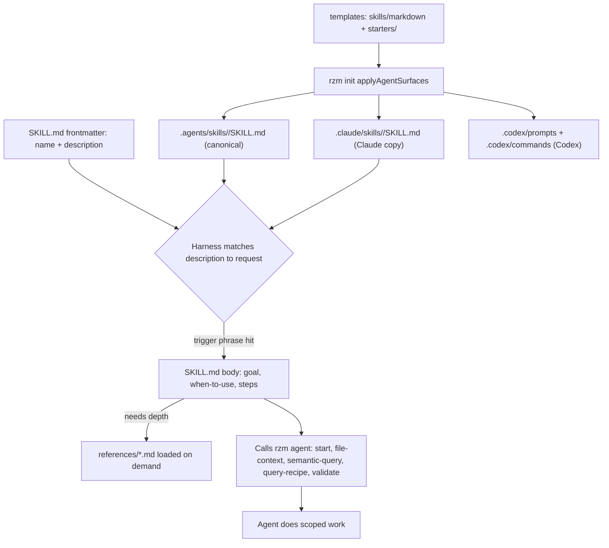

# Agent Skills (Hub)

### What this hub is for

- **Purpose**: Understand what a Rhizome skill is, how it routes work and pulls `rzm agent` context, where skills live, and how `rzm init` ships them to Claude and Codex harnesses.
- A **skill** is a packaged agent workflow: one `SKILL.md` with `name` + `description` frontmatter plus a body, optionally backed by `references/` files loaded on demand (progressive disclosure).
- Skills route the Agentic Engineering delivery workflow (see [[Agentic Engineering starter (Hub)]]) and teach agents to rediscover live contracts from `rzm agent` instead of hard-coding stale repo knowledge.

### How a skill is structured and surfaced

The left path is runtime (how a skill triggers and runs); the right path is install-time (how `rzm init` materializes skill copies per harness). Both feed the same harness discovery surface.

### Read this first

- [[Agent Skills - Claude + Codex]] — durable cross-harness contract (folder layout, metadata-first discovery, progressive disclosure)
- [[Agent Skills - Anthropic Skills Guide]] — Anthropic Agent Skills concepts, packaging, and runtime constraints
- [[Agent Skills - Authoring best practices]] — concise bodies, trigger-phrase descriptions, scoped freedom, multi-runtime testing
- [[Agent-ready workflows (prompts, commands, skills)]] — how skills sit beside prompts and commands as agent surfaces
- [[Init - Agent surfaces (prompts, commands, skills)]] — how `rzm init` writes and refreshes those surfaces

### Reading order (for onboarding)

1. [[Agent Skills - Anthropic Skills Guide]] — what a skill is and why metadata drives discovery
2. [[Agent Skills - Authoring best practices]] — how to write a body that triggers reliably and stays short
3. [[Agent Skills - Claude + Codex]] — the cross-harness packaging contract
4. [[Agentic Engineering starter (Hub)]] — workflow and starter ownership
5. `.agents/skills/agentic-engineering/SKILL.md` — the router for unclear delivery work
6. `pkg/app/cli/init/templates/skills/markdown/rhizome/SKILL.md` — core Rhizome operations plus topic routing for live `rzm agent` contracts
7. `pkg/app/cli/init/agent_surfaces.go` — install-time materialization across harnesses

### Key concepts

- **SKILL.md anatomy**: YAML frontmatter (`name`, `description`) + Markdown body (Goal / When to use / Non-goals / Operating mode / steps). The `description` is the router: harnesses match it to the request, so it must name real trigger phrases, not abstract labels.
- **Progressive disclosure**: keep the body short; push depth into sibling `references/*.md` under the core `rhizome` skill, then load only the reference needed for the current operation.
- **Routing vs execution**: `agentic-engineering` is the doorway and takes the phase as its argument; `foundation-review` and `ingest-transcript` are the only separate workflow skills. Team policy lives in `docs/engineering/` concern documents, which outrank skill defaults.
- **Retrieval-driven skills**: skill bodies call `rzm agent start` (reuse `sessionId`), then `file-context`, `semantic-query`, `query-recipe`, and `validate` rather than embedding stale repo facts. This keeps skills durable as the repo evolves.
- **Core vs starter skills**: one base `rhizome` skill ships for every enabled skill surface; template-specific starters layer phase/loop skills on top. Name collisions across bundles are explicit errors, so a starter cannot silently shadow the core skill.

### Skill source families (template tree)

- **Core (every repo)** — `pkg/app/cli/init/templates/skills/markdown/rhizome/`: one `rhizome` skill for basic operations and focused topic routing.
- **Starter (per template)** — `pkg/app/cli/init/templates/starters/<template>/agents/skills/`: the Agentic Engineering router, lazy phase references, and two workflow skills; also `complex-domain` and `action-items` starters.
- Loaded by `loadSkillTemplates` (core) + `loadStarterSkillTemplates` (per template), merged by `loadAllSkillTemplates` in `pkg/app/cli/init/helper_templates.go`.

### Built-in skills (when to use which)

- **`agentic-engineering`**: route broad delivery work to one lazy phase resource; use a thin adapter directly when the phase is already known.
- **`rhizome`**: start and reuse a session, search, load file context, orient to unfamiliar topics, configure or troubleshoot integration, validate or repair a vault, and route structured-markdown, ontology, mutation, and skill-authoring questions to focused references.
- **`foundation-review`, `ingest-transcript`**: the two workflow skills that are not router phases. Phases are invoked as `agentic-engineering <phase>`.
- **Core Rhizome documentation and structural-analysis references**: own reusable code/doc binding and refactor-evidence mechanics without separate workflow skills.
- **`skill-creator` (when present)**: own general skill creation. Ask whether Rhizome capabilities such as search, GraphQL queries, or query recipes would help; if the user opts in, load the `rhizome` skill-authoring reference.

### Entry points

- `docs/engineering/workflow.md` in an installed repository — the team's policy extension for phase routing and boundaries
- `.agents/skills/` — canonical installed skill tree (`<name>/SKILL.md` + optional `references/`)
- `pkg/app/cli/init/templates/skills/markdown/` — core skill source templates (init-only; edit here, not generated copies)
- `pkg/app/cli/init/templates/starters/<template>/agents/skills/` — template-specific starter skill source
- `pkg/app/cli/init/agent_surfaces.go` — `applyAgentSurfaces*` writes `.agents/skills`, `.claude/skills`, and `.codex` surfaces
- `pkg/app/cli/init/helper_templates.go` — `loadSkillTemplates` / `loadStarterSkillTemplates` / `loadAllSkillTemplates`

### Integration points

- **`rzm init`** ([[Init (Hub)]]): materializes skills per selected harness. Canonical copies land in `.agents/skills/`; Claude harness also copies to `.claude/skills/` (plus `.claude/commands` + `.claude/prompts`); Codex harness writes `.codex/prompts` + `.codex/commands` and the `.agents/skills` tree. Retired managed skills are cleaned only after their consolidated replacement is written successfully.
- **`rzm agent`** ([[Search (Hub)]], [[Ontology (Hub)]]): skills call `start`, `file-context`, `semantic-query`, `files`, `query-recipe`, and `validate` as their retrieval substrate.
- **RHIZOME.md guidance**: complementary, not the same thing. RHIZOME.md (embedded directly from `docs/rhizome-md-templates/`) is the lean always-on integration and routing block; the `rhizome` skill carries operational guidance and focused references. Template-specific skills continue to own their deliverables.
- **Agentic Engineering workflow** ([[Agentic Engineering starter (Hub)]]): the router owns sequence; local `docs/engineering/` documents provide team policy without duplicating managed ontology mechanics.

### Related documentation

- [[Vision + Operating Model (Hub)]]
- [[documentation-binding-rationale]]
- [[Rhizome Codebase Documentation Best Practices (Hub)]]
- [[Init (Hub)]]

### Invariants / rules of thumb

- `SKILL.md` lives at the root of each skill directory; `name` + `description` frontmatter is mandatory and `description` is the discovery key.
- Keep bodies short; push depth into `references/` via progressive disclosure.
- Author skills once in the init template tree (`templates/skills/...` and `templates/starters/...`); never hand-edit generated `.claude/skills` or `.codex` copies.
- Teach skills to rediscover live contracts from `rzm agent` (reuse one `sessionId`) rather than embedding stale repo facts.
- Honor decision boundaries (plan approval before implementation, destructive actions, scope changes); an approved plan is authorization to finish every step it covers.
- Keep skill scope bounded: one workflow per skill; route broad asks through `agentic-engineering`, then hand off.
- Core and starter skill names must not collide — collisions are explicit init errors, not silent shadowing.
