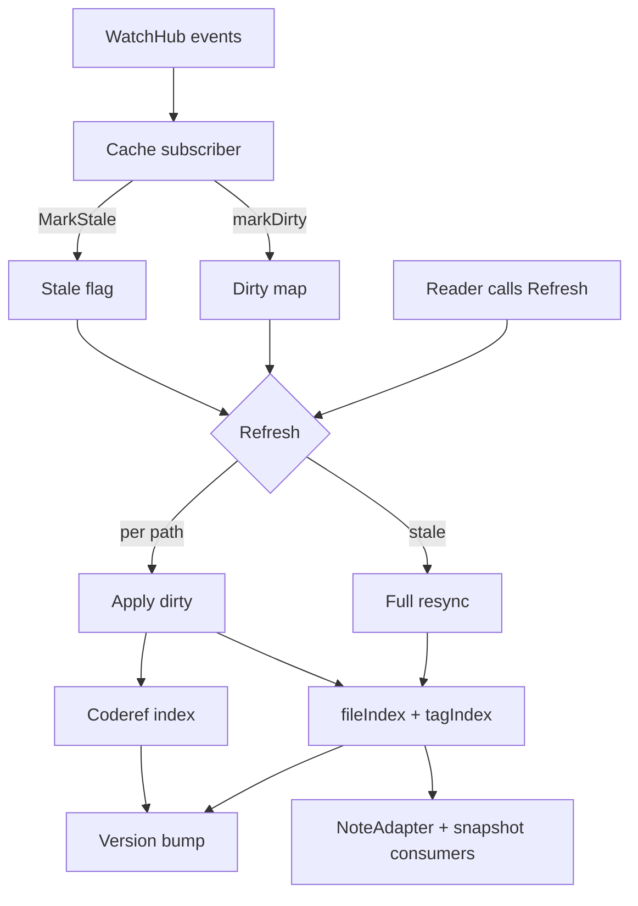

# Cache (Hub)

### What this hub is for

- **Purpose**: Understand how `pkg/vault/cache` keeps vault metadata hot — an in-memory note view fed by coalesced filesystem hints — and how derived analyses (backlinks, graph, coderefs) reuse it without rescanning.
- **Mental model**: watcher events are *hints*, not truth. They become dirty markers; `Refresh()` is the synchronous front door that drains them into deterministic index updates and bumps a version counter.

### Architecture overview

- Stages 1-2 (event translation) live in `watchhub.go`; the dirty/stale state and `Refresh()`/`resync()` core live in `service.go`. Coderef maintenance is the optional branch (only when `CodeRefConfig.Enabled`).

### Reading order (for onboarding)

1. [[Vault cache service (Service)]] — lifecycle, stored `Entry` shape, refresh contract, safe-change boundaries
2. [[Dirty tracking + Refresh semantics]] — the `DirtyKind` state machine, coalescing, and `Refresh()`/`resync()` flow
3. [[Watcher design + degraded mode]] — how WatchHub feeds the dirty set and signals stale (owned by [[Indexing pipeline (Hub)]])
4. [[Ignore + exclude rules]] — unified matcher precedence and ignore-change invalidation
5. [[Code reference scanning in cache]] — optional incremental coderef maintenance
6. [[AnalysisCache (backlinks + graph memoization)]] — removal rationale for the unused memoization layer
7. `pkg/vault/cache/CONTEXT.md` — terse module summary at the source

### Key concepts

- **Dirty map (`path -> DirtyKind`)**: async/sync boundary. Kinds are `created`, `modified`, `removed`, `renamed`, `recreated`; coalescing in `markDirty` collapses delete+create bursts into `recreated` and keeps `removed` sticky. See [[Dirty tracking + Refresh semantics]].
- **Stale → resync**: WatchHub errors, directory renames, and ignore-file changes set `stale`; the next `Refresh()` starts one background `initialCrawl` (single-flight) and returns the current index while dirty events keep applying. The crawl reconciles the live index in place (evicts what discovery no longer returns, force re-reads the rest, yields to newer concurrently committed entries) with `ready` left true, so no reader waits on it; only the very first crawl blocks readers. `RefreshResult.Resynced` reports the crawl's completion on a later refresh.
- **Version as invalidation key**: `Version()` bumps on initial crawl, applied dirty changes, and resync completion.
- **Internal freshness paths**: edits to `.rhizome/config.yml`, `.rhizome/ignore`, `.obsidianignore`, ontology `*.graphql`, and query-recipes force a version bump so config-derived consumers refresh (see `isInternalFreshnessPath`).
- **One watcher per vault**: only the vault runtime that won `.rhizome/runtime.lock` watches the filesystem; other processes are one-shot readers (see [[vault-runtime]]).

### Entry points (code)

- `pkg/vault/cache/service.go` — `Service`: `NewService`, `EnsureReady` (one-time crawl), `Refresh`/`RefreshAndDrainDirty`, `MarkDirty`/`MarkStale`, `Entry`/`EntriesSnapshot`, `Version`, `Metrics`
- `pkg/vault/cache/watchhub.go` — `SubscribeWatchHub` + `handleCacheEvent`: translate watch events into dirty markers (recreate, rename→parent rescan, dir-rename→stale)
- `pkg/vault/cache/note_adapter.go` — `NoteAdapter`: `obsidian.NoteReader` backed by the cache, with disk fallback
- `pkg/vault/ignore/` — `LoadUnifiedMatcher` composes `.gitignore` + `.rhizome/ignore` + `.obsidianignore` + user excludes (see [[Ignore + exclude rules]])
- `pkg/vault/coderefs/` — code↔note reference scanning + index, driven by the cache when enabled (see [[Coderefs (Hub)]])

### Integration points

- `pkg/app/bootstrap/live.go` — constructs `cache.Service`, subscribes to WatchHub, and warms the note cache asynchronously for long-lived runtimes (`serve`, web)
- `pkg/app/web/server.go` — uses `NoteAdapter` for cache-backed note reads and a separate graph-response cache
- `pkg/app/cli/*` — body-heavy commands benefit from cached entry snapshots; note metadata/query paths increasingly prefer the unified SQLite/session store

### Invariants / rules of thumb

- **Callers must refresh**: most reads (`Entry`, `Paths`) assume a prior `Refresh()`. `EntriesSnapshot` and `NoteAdapter` are the refresh-aware exceptions.
- **Stale means resync**: do not try to patch incrementally when correctness is uncertain — set stale and let the background `initialCrawl` reconcile.
- **Version drives derived caches**: any new cache keyed on cache state must invalidate on `Version()`; never cache results computed across a version change.
- **Ignore evaluation is centralized**: crawl, rescan, and code scanning all consult the one unified matcher; `.rhizome/ignore` writes must trigger stale/resync.
- **Disk I/O outside the mutex**: `Refresh` snapshots state under lock, then touches disk lock-free; failed paths are re-marked dirty rather than dropped.

### How to make safe changes

- **Touching WatchHub wiring** (`watchhub.go`): preserve the recreate/rename→parent and dir-rename→stale mappings; ensure watcher errors/closures still call `MarkStale`.
- **Changing ignore rules**: keep evaluation in the unified matcher; ensure `.rhizome/ignore` edits route through `isInternalFreshnessPath` so the cache resyncs.
- **Changing version bumping**: audit downstream caches keyed by `Version()` before altering bump conditions.

### Runbook

- [[Debugging cache staleness + watcher issues]]

### Related hubs

- [[Indexing pipeline (Hub)]] — owns watcher/refresh coordination details
- [[Graph (Hub)]] — graph computation and consumers
- [[Coderefs (Hub)]] — coderef scanning internals
- [[Vision + Operating Model (Hub)]] — system-wide context
