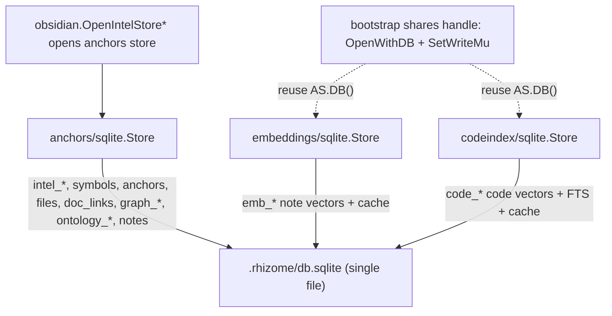
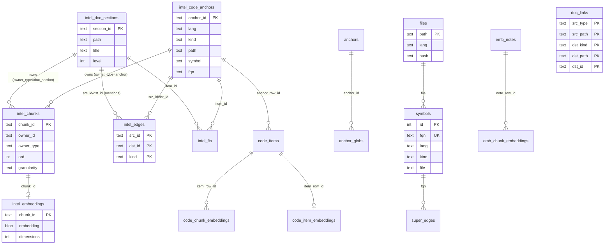

# Code Index (Hub)

## What this hub is for

- One place to understand the **physical storage layer**: the single `.rhizome/db.sqlite` file and the table families inside it (`intel_*`, `code_*`, `emb_*`, plus graph/ontology/note tables).
- A map from **Go store layers** (`pkg/anchors/sqlite`, `pkg/search/embeddings/sqlite`, `pkg/search/embeddings/codeindex/sqlite`) to the tables they own and how they **share one SQLite handle** under `serve`.
- **Not** the data model and **not** the build pipeline:
  - [[Code Intel (Hub)]] is the higher-level data-model/spine (stable IDs, typed edges, retrieval semantics). This hub is the file those concepts persist into.
  - [[Indexing pipeline (Hub)]] is the build process (parse → chunk → embed → write). This hub is the destination it writes to.

## Architecture overview

Three independent Go store types ensure their own table families inside the same DB file. Under `serve` they are opened over **one shared `*sql.DB` handle** and serialize writes through one mutex; one-shot CLI commands open the file directly.

- `OpenIntelStoreFromConfig*` (in `pkg/vault/obsidian/intel_store.go`) is the canonical entry: it resolves the unified path, opens the anchors store, and returns a cleanup func.
- In `serve`, `pkg/app/bootstrap/live.go` hands the anchors store's `DB()` to the embeddings and codeindex stores via `OpenWithDB`, and sets a shared write mutex (`SetWriteMu`) so all three serialize commits on the single WAL writer.

## Reading order

1. [[Code Index - Unified SQLite DB]] — operational current-state note (layout, locking, throughput, separable rebuilds).
2. [[Intel Spine - Current State]] — table-by-table ownership and provenance (read for exact `intel_*` semantics).
3. [[Code Intel - Data model (anchors, sections, edges)]] — the conceptual model the `intel_*` tables persist.
4. [[semantic-code-index-spine]] — technical spec for the unified spine and embeddings unification.
5. `pkg/anchors/sqlite/store.go` — schema migrations + `intel_*`/`symbols`/`anchors`/`doc_links`/`graph_*` DDL and the vec-primary cutover.
6. `pkg/search/embeddings/sqlite/store.go` — `emb_*` note-embedding tables + `emb_chunk_embeddings_vec_d{N}` mirrors.
7. `pkg/search/embeddings/codeindex/sqlite/store.go` — `code_*` code-embedding tables, `code_chunk_fts`, and `code_*_vec_d{N}` mirrors.
8. [[pkg/anchors/CONTEXT|Anchors module]] and [[pkg/search/embeddings/CONTEXT|Embeddings module]] — module-level orientation.

## Unified DB table map (erDiagram)

Core spine and supporting families. `intel_*` is authoritative for anchors/sections/edges/chunks; the unified vector store is `intel_embeddings`, keyed by `intel_chunks.chunk_id`. The `code_*` and `emb_*` families are the per-domain embedding stores (with their own caches and `vec0` mirrors).

Note: `calls` was removed (anchors store v15→v16); call/reference edges now live in `intel_edges` and `intel_symbol_refs`/`intel_import_refs`/`intel_module_defs`. Legacy `code_chunk_embeddings` → `intel_embeddings` migration exists for older DBs.

## Key concepts

- **`intel_*` is the spine.** Anchors (`intel_code_anchors`), doc sections (`intel_doc_sections`), typed edges (`intel_edges`), ordered chunks (`intel_chunks`), the unified vector store (`intel_embeddings`), and FTS (`intel_fts` + `intel_fts_rowid`). These are **derived** and safe to drop/rebuild.
- **Two embedding domains, one DB.** Note vectors live in `emb_*` (owned by `embeddings/sqlite`); code vectors live in `code_*` (owned by `codeindex/sqlite`). Both keep a content-hash **embedding cache** (`emb_embedding_cache`, `code_embedding_cache`) so rebuilds reuse vectors when provider/model match.
- **`vec0` mirrors are sidecars.** Each per-dimension `*_vec_d{N}` table is a `sqlite-vec` `vec0` virtual table kept in sync by triggers on the canonical `embedding BLOB` rows. `intel_embeddings_vec_d{N}` uses `distance_metric=cosine`; the vec table is the ANN search surface, the BLOB column is the source of truth (`EnsureEmbeddingsVecPrimary` handles the vec-primary cutover).
- **Doc-links vs edges.** `doc_links` records source→target reference rows (coderefs, wikilinks); `intel_edges` with `kind='mentions'` is the primary "docs for code" mechanism the spine retrieves on.
- **Graph + ontology + note tables co-resident.** `graph_doc_scores`/`graph_doc_edges`/`graph_anchor_scores` (PageRank/communities), `ontology_*` (typed-note model), and `notes`/`note_property_values`/`note_tags` all live in the same file, plus `mcp_sessions`/`mcp_session_items` for server session state.
- **Schema versioning is per-domain.** Domains (`DomainCodeEmbeddings`, etc.) track versions in `rzm_migration_state`/`rzm_migration_log`; the anchors store carries its own numbered migration chain.

## Entry points (code)

- `pkg/vault/obsidian/intel_store.go` — `OpenIntelStoreFromConfig*` / `OpenIntelStoreForWrite*` / `OpenIntelStoreWithRecovery`: canonical open paths, corruption auto-recovery (preserve `emb_*` then full rebuild), and `IntelStoreOpenOptions` (txlock, pool).
- `pkg/vault/obsidian/index_path.go` — `UnifiedIndexPath`: resolves the single `.rhizome/db.sqlite` path.
- `pkg/anchors/sqlite/store.go` — anchors store: `intel_*`, `symbols`, `anchors`, `files`, `doc_links`, `graph_*`, `ontology_*`, `notes`; migration chain; `OpenWithDB` (shared handle); `DB()`/`SetWriteMu`; `intel_embeddings_vec_d{N}` + `EnsureEmbeddingsVecPrimary`.
- `pkg/search/embeddings/sqlite/store.go` — note-embedding store: `emb_index_meta`, `emb_notes`, `emb_chunk_embeddings`, `emb_embedding_cache`, `emb_chunk_embeddings_vec_d{N}`; `OpenWithMetadataWithDB`.
- `pkg/search/embeddings/codeindex/sqlite/store.go` — code-embedding store: `code_index_meta`, `code_items`, `code_item_embeddings`, `code_chunk_embeddings`, `code_chunk_fts`, `code_embedding_cache`, `code_*_vec_d{N}`; `ResetDomain` / `ResetDomainPreservingCache`.
- `pkg/app/bootstrap/live.go` — `serve` handle sharing: opens the anchors store, then `OpenWithDB(store.DB())` for embeddings/codeindex stores and `SetWriteMu(&sharedWriteMu)`.
- `cmd/index.go` — orchestrates semantic + code indexing and separable rebuild behavior.
- `pkg/anchors/service.go` — ingestion/indexing surface that writes the spine tables.

## Integration points

- **Read consumers**: [[Search (Hub)]] retrievers and `pkg/anchors/sqlite/intel_query.go` query `intel_*`, the `*_vec_d{N}` mirrors, and FTS. `file_context` / dependency cards ([[docs/specs/product/code-intel|Code intel navigation (CLI)]], [[dependency-api-cards|Dependency API Cards (file_context view)]]) read anchors, sections, and edges.
- **Write producers**: [[Indexing pipeline (Hub)]] (`cmd/index.go`, `pkg/anchors/service.go`) and the embedding syncers populate the tables; the watcher uses `.rhizome/index.lock` to avoid concurrent writers.
- **Graph layer**: PageRank/community scoring writes `graph_doc_scores`/`graph_doc_edges`/`graph_anchor_scores` (see [[Graph (Hub)]]).
- **Cache layer**: see [[Cache (Hub)]] for the embedding-cache reuse contract on rebuild.

## Chunk provenance (quick ref)

| Domain | Input rows | Vectors | ANN mirror |
| --- | --- | --- | --- |
| Note chunks | `intel_doc_sections` → `intel_chunks` (`doc_section`) | `intel_embeddings`; legacy `emb_chunk_embeddings` | `intel_embeddings_vec_d{N}`; `emb_chunk_embeddings_vec_d{N}` |
| Code chunks | `intel_code_anchors` → `intel_chunks` (`anchor`) | `intel_embeddings`; `code_chunk_embeddings` | `intel_embeddings_vec_d{N}`; `code_chunk_embeddings_vec_d{N}` |
| FTS | anchors + sections | `intel_fts` (+ `intel_fts_rowid`); `code_chunk_fts` | — |

See [[Intel Spine - Current State]] for authoritative per-table ownership.

## Invariants / rules of thumb

- **One DB, separable rebuilds.** Semantic-only rebuild drops `emb_*`; code-only rebuild drops `code_*` + their vec mirrors; the `intel_*` spine is derived and reindexed; embedding caches are preserved when provider/model/dims still match.
- **One writer lane.** SQLite WAL allows many readers but one writer commit; under `serve` all three stores share one mutex via `SetWriteMu`. Prefer per-open `_txlock` over runtime mutation; batch writes into larger transactions.
- **vec mirrors follow, never lead.** Treat `embedding BLOB` rows as source of truth and `*_vec_d{N}` as trigger-maintained sidecars; never write the vec table directly.
- **Root-relative, slash-normalized paths.** Persisted paths survive directory moves; do not store absolute or escaped paths (see repo path-normalization rules).
- **Docs attach via edges.** Prefer `intel_edges` `kind='mentions'` (doc section → anchor) as the primary "docs for code" link; `doc_links` and ancestor docs are inputs/fallbacks.
- **Corruption is auto-healed.** `OpenIntelStoreWithRecovery` first tries to preserve `emb_*`, then falls back to lock-checked removal + rebuild; never delete the DB out from under a holder of `.rhizome/index.lock`.
