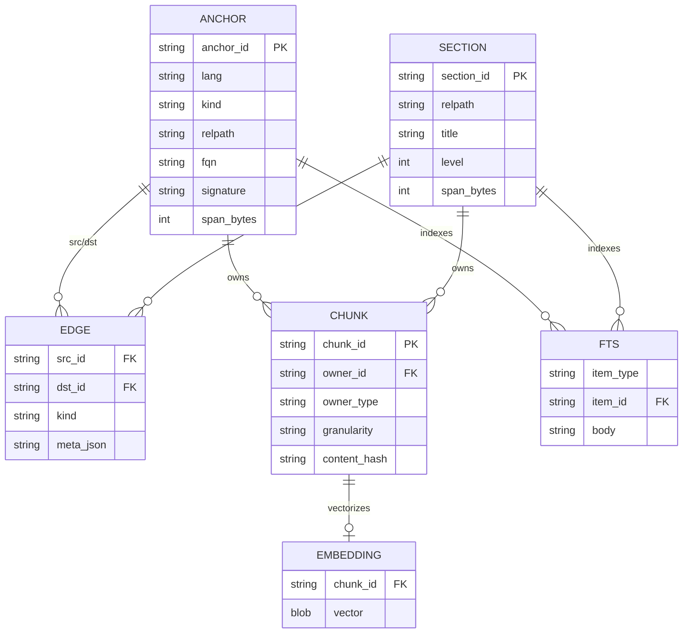
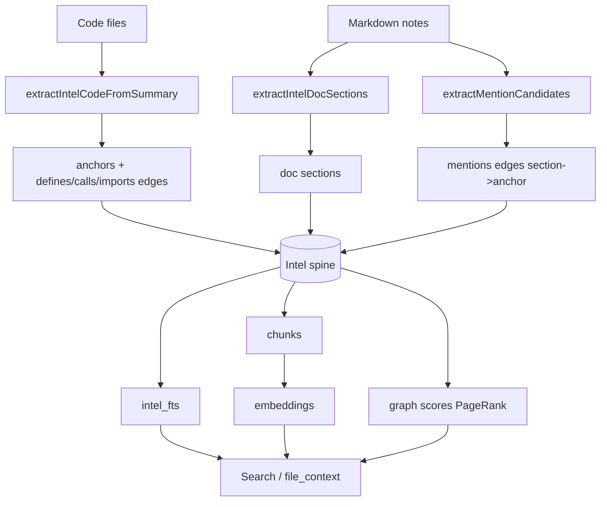

# Code Intel (Hub)

### What this hub is for

- **Purpose**: Define the code-intel *data model* — the conceptual "spine" of canonical handles (`anchor_id`, `section_id`, `chunk_id`) and typed directed edges that fuse code symbols, documentation sections, semantic chunks, and graph evidence into one deterministic retrieval substrate.
- **Altitude**: This hub is the data-model layer. It sits **above** [[Code Index (Hub)]] (the physical `.rhizome/db.sqlite` store + table layout) and **below** [[Search (Hub)]] / `file_context` (the consumers that read the spine). The build that *populates* the spine belongs to [[Indexing pipeline (Hub)]].
- **Frozen contract**: [[semantic-code-index-spine|SPEC-0011]] freezes the durable shape (canonical handles, vault-relative path/ID rules, minimum edge vocabulary).

### Boundary (what this hub is NOT)

- **Not the physical store**: table DDL, row layout, locking, rebuild splits, and `emb_*`/`code_*` tables are [[Code Index (Hub)]] / [[Code Index - Unified SQLite DB]]. This hub describes the *logical* entities those tables persist.
- **Not the build pipeline**: discovery → parse → queue → embed → graph-score → live-update is [[Indexing pipeline (Hub)]]. This hub describes *what gets persisted*, not *how indexing runs*.
- **Not the docs→code binding layer**: note-frontmatter anchors (which notes apply to a file) are [[Code anchors (Hub)]]. This hub consumes their output as `mentions` edges.
- **Packaging terminology**: the "Dependency API Cards" below are a planned presentation view, not a generated semantic chunk family. Indexed code retrieval stays source-owned.

### Reading order

1. [[semantic-code-index-spine|SPEC-0011]] — the frozen durable contract (handles, path rules, edge minimum)
2. [[Code Intel - Data model (anchors, sections, edges)]] — canonical handle model in prose
3. [[Code Intel - IDs + path normalization]] — exactly what hashes into each ID
4. [[Intel Spine - Current State]] — current persisted tables + edge kinds
5. [[Code Intel - Query patterns + graph analysis]] — common typed-edge traversals
6. [[Code Index (Hub)]] — where these entities physically live and how they are built
7. `pkg/anchors/intel.go` — the actual Go structs for every entity below

### Architecture overview

The spine is three addressable item families joined by typed directed edges. Code and docs are extracted into the same entity model, then evidence (lexical FTS, semantic chunk embeddings, graph edges) accumulates against the **same canonical handles** so every downstream surface ranks against one identity, not parallel keys.

How code + docs + embeddings become unified evidence:

### Key concepts

- **Canonical handles**: only `anchor_id` (code entity + span) and `section_id` (doc heading section or whole-file fallback) are public handles; `chunk_id` is a derived content unit. Internal SQLite row ids are join accelerators only — read paths synthesize external handles at the boundary. See [[Code Intel - Data model (anchors, sections, edges)]].
- **ID stability inputs** (from `intelAnchorID` / `intelDocSectionID` / `IntelChunkID` in `pkg/anchors/intel_util.go`):
  - `anchor_id` = sha256(`lang`, `kind`, `relPath`, `stableKey`) where `stableKey` is the FQN (or `"module"` for the file-level anchor).
  - `section_id` = sha256(`relPath`, `breadcrumbSlug`, `startByte`).
  - `chunk_id` = sha256(`owner_id`, `ord`, `granularity`).
  - All paths are vault-root-relative + slash-normalized + cleaned before hashing — see [[Code Intel - IDs + path normalization]] and [[PathRef contract]]. IDs are stable-ish across formatting, not immutable across large renames.
- **The `module` anchor**: every code file gets a synthetic `kind: module` anchor; each symbol anchor is linked back via a `defines` edge (`module → symbol`).
- **Typed directed edges** (`IntelEdge{SrcID, DstID, Kind, MetaJSON}`): the spine's relationship layer.
  - **Doc-domain** (high signal, weight 1.0): `wikilink`, `coderef`, `mentions`. `mentions` (section → anchor) is the primary docs-to-code attachment path; coderefs/code-anchors are inputs that *produce* `mentions`, not replacements.
  - **Code-domain** (best-effort, PPR-weighted): `calls` (0.25), `type_ref` (0.15), `member_ref` (0.12), `imports` (0.10), `tests` (0.08). Structural `defines` edges exist but carry no PPR weight. See `pkg/anchors/edge_kinds.go` for the authoritative weight/clamp/priority registry.
  - SPEC-0011 freezes only `defines`/`mentions`/`calls`/`tests` as the *durable minimum*; the live registry is a superset.
- **Chunks + embeddings**: chunks (`IntelChunk`) are first-class records with provenance (`owner_type` ∈ `anchor`/`doc_section`/`ontology_node`, `ChunkFamily`, `granularity`, ordinal) so embedding sync is deterministic and scoped. Ontology-node chunks sidecar their invalidation metadata in `ontology_node_embedding_state` rather than widening the shared chunk table.
- **FTS**: `intel_fts` rows index both anchors and doc sections (`item_type` ∈ `anchor`/`doc_section`) so lexical retrieval hits the same handles as semantic/graph evidence.

### Entry points (code)

- `pkg/anchors/intel.go` — every spine entity struct: `IntelAnchor`, `IntelDocSection`, `IntelChunk`, `IntelEdge`, `IntelFTSRow`, `IntelOntologyNode`, embedding-state sidecar
- `pkg/anchors/intel_util.go` — `intelAnchorID`, `intelDocSectionID`, `IntelChunkID` (the canonical ID hashers)
- `pkg/anchors/edge_kinds.go` — `EdgeKinds` registry: domain, PPR weight, clamp, priority per edge kind
- `pkg/anchors/intel_extract_code.go` — `extractIntelCodeFromSummary`: code file → module/symbol anchors + `defines` edges + FTS
- `pkg/anchors/intel_extract_notes.go` — `extractIntelDocSections`: note → doc sections + FTS
- `pkg/anchors/intel_mentions.go` — `extractMentionCandidates`: note text → `mentions` edge candidates
- `pkg/anchors/service_intel.go` — call/import/type_ref/member_ref edge construction + `RebuildAllCallEdges` deferred resolution
- `pkg/anchors/sqlite/intel_query.go`, `intel_lookup.go`, `intel_search.go`, `intel_pagerank.go` — read paths: typed-edge expansion, handle lookup, FTS search, graph scores
- `pkg/app/codeintel/ingest.go`, `store.go` — command-facing ingest orchestration that drives the extractors ([[pkg/app/codeintel/CONTEXT|codeintel orchestration]])

### Consuming surfaces (features)

- [[docs/specs/product/code-intel|SPEC-0015]] — Code Intel Navigation: deterministic handle-based search + typed expansion (`calls`/`tests`/`mentions`) + budgeted kickoff packs. Surfaced primarily by enriching `file_context` / `semantic-query`.
- [[dependency-api-cards|SPEC-0031]] — Dependency API Cards: a *planned* `file_context` packaging view that groups per-dependency used surface + owned docs over the same handles. Packaging layer only; no parallel identity model.

### Integration points

- **Physical persistence**: all entities land in `.rhizome/db.sqlite` (`intel_code_anchors`, `intel_doc_sections`, `intel_edges`, `intel_chunks`, `intel_embeddings`, `intel_fts`, `ontology_nodes`, `ontology_node_embedding_state`). Layout owned by [[Code Index (Hub)]] / [[Code Index - Unified SQLite DB]].
- **Population**: [[Indexing pipeline (Hub)]] runs the extract → queue → embed → graph-score build that fills the spine.
- **Docs→code attachment**: [[Code anchors (Hub)]] resolves which notes apply to a file (`Service.NotesForFile`) and feeds `mentions`.
- **Embeddings**: [[Embeddings (Hub)]] vectorizes chunks; vectors key back to `chunk_id`.
- **Retrieval**: [[Search (Hub)]] ranks lexical + semantic + graph evidence against the canonical handles; `file_context` uses anchored notes + ancestor docs.
- **Per-file binding doc**: [[Go anchor - Code Index (unified DB + intel)]] keeps the Go spine code attached to these notes via code anchors.

### Invariants / rules of thumb

- **One handle system**: addressable items are only `anchor_id` and `section_id`; downstream surfaces MUST NOT key off `(lang, path, symbol)` tuples or internal row ids.
- **Mentions first**: docs attach to code primarily via `mentions` (doc section → anchor); coderefs/anchors are inputs/fallbacks that produce `mentions`.
- **Vault-relative paths only in IDs**: absolute paths are an I/O concern and never participate in canonical IDs or stored keys.
- **Rebuildable**: the spine reconstructs from source + notes; never hand-repair persisted semantic rows. Unresolved code edges are *rebuilt* (see `RebuildAllCallEdges`), not persisted as partial state.
- **Best-effort edges stay marked**: `calls`/`tests` (and the broader code-domain edges) carry provenance/limitations to consumers; never treat parser-inferred edges as authoritative.
- **Deterministic outputs**: stable tie-breakers, explicit limits, bounded traversal depth, continuation tokens.
- **Cards are a view, not an identity**: any card-style packaging (dependency or ontology) must derive from canonical handles, not invent parallel keys.
