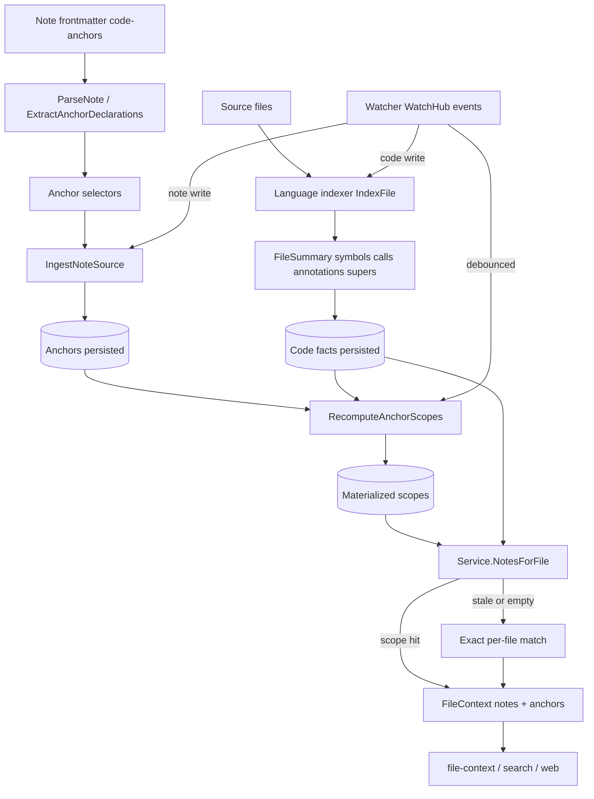

# Code anchors (Hub)

### What this hub is for

- **Purpose**: Understand and safely change the codeanchor subsystem (`pkg/anchors`): how notes declare anchors in frontmatter, how anchors match code symbols/calls/paths, how scopes are materialized and recomputed, and how the watcher keeps everything current.
- Code anchors are the **note → code** half of bidirectional binding. The code → note half lives in [[Coderefs (Hub)]]. Both feed the unified index ([[Code Index (Hub)]]) and surface through [[Code Intel (Hub)]] and [[Search (Hub)]].

### Architecture overview

A note declares `code-anchors:` in its frontmatter. Ingest parses those declarations into `Anchor` selectors, persists them, then materializes a **scope** (the concrete symbols/files each anchor resolves to) by matching against the indexed code facts. Readers ask "which notes apply to this file?" via `Service.NotesForFile`, which prefers the materialized scopes and falls back to exact per-file matching when scopes are missing or stale. The watcher drives both note ingest and code indexing incrementally so scopes stay fresh during live runs.

### Reading order

1. [[Vision + Operating Model (code anchors)]] — why note→code binding exists and how it serves agents
2. [[code-anchors-frontmatter-syntax]] — selector shapes (`symbol`, `calls`, `baseClass`, `decorator`, `dir`, `glob`/`globs`, `ref:` shorthand)
3. [[code-anchors-matching-scopes]] — how selectors resolve to scopes and how recompute stays targeted
4. [[code-anchors-watcher-incremental-updates]] — live update flow, debounce, overflow, retry
5. [[code-anchors-language-support]] — adding/expanding a language indexer + the integration-test pattern
6. `pkg/anchors/CONTEXT.md` — module-level invariants and batch-write boundaries
7. `pkg/anchors/frontmatter.go` and `pkg/anchors/service_query.go` — the parse and read paths in code

### Key concepts

- **Directionality**: code anchors are **note → code**. A note's frontmatter points at code; code does not point back here (that is [[Coderefs (Hub)]]).
- **Selector vs. scope**: an `Anchor` is the author-facing selector; the **scope** is the materialized set of symbols/call-files it resolves to. Selectors are stable; scopes are derived and recomputable.
- **Anchor kinds** (`pkg/anchors/types.go`, verified): `baseClass` (matches a base type + its descendants), `annotation` (decorator/attribute usage), `function` (definition site + call sites; authored as `symbol:` or legacy `calls:`), `path` (directory prefix), `glob` (doublestar patterns; `dir:` is a legacy alias).
- **Fully-qualified targets**: `symbol`/`calls`/`baseClass` require `pkg.Name`; empty pkg is only allowed as a decorator wildcard.
- **Labels are stable IDs**: treat anchor labels like API names — they group notes and appear in traces.
- **Supported languages**: `py`, `go`, `ts` (`.ts/.tsx/.mts/.cts/.js/.jsx/.mjs/.cjs`), `cs`, and `php` have indexers wired into discovery and watching. The JS/TS family supports repository-local literal NodeNext, workspace-package, config-alias, and barrel resolution; computed/runtime targets remain unresolved. See [[typescript-javascript-indexer-coverage]]. `normalizeLang` also accepts `java`/`swift`/`kotlin` aliases but no indexers ship for them yet.
- **Scopes are an optimization, not the source of truth**: `NotesForFile` falls back to exact matching and warms scopes asynchronously when scopes are missing, dirty (overflow), or suspiciously empty for a fact-rich file.

### Entry points (code)

- `pkg/anchors/frontmatter.go` — `ParseNote` + `buildAnchorsNew`; parses `code-anchors:` (and legacy `anchors:`) into `Anchor` selectors
- `pkg/anchors/service_indexing.go` — `IngestNoteSource` (canonical snapshot → anchor ingest), `IndexCodeFileRef` (code indexing), `DeleteNote` / `DeleteFile`
- `pkg/anchors/service_query.go` — `NotesForFile` (the retrieval-facing read path) and `SymbolsForFile`
- `pkg/anchors/service_scopes.go` — `RecomputeAnchorScopes` / `RebuildAnchorScopesForIDs`, dirty tracking, descendant collection, async scope warming
- `pkg/anchors/types.go` — `Anchor`, `AnchorKind`, `SymbolRef`, `FileSummary`, `FileContext`
- `pkg/anchors/indexer.go` — `LanguageIndexer` interface (`IndexFile`, `Lang`) and `IndexerVersion`
- `pkg/anchors/indexer_go.go`, `indexer_python.go`, `indexer_ts.go`, `indexer_cs.go` — per-language `FileSummary` extraction
- `pkg/anchors/watcher.go` — fsnotify watcher loop, debounce, overflow rescan, retry backoff, deletion reconciliation
- `pkg/anchors/watchhub.go` — `NewHubSubscriber` / `HandleWatchEvents`; consumes shared [[Indexing pipeline (Hub)]] WatchHub events instead of raw fsnotify
- `pkg/anchors/sqlite/store.go` — persistence for anchors, scopes, symbols, calls, annotations

### Integration points

- `pkg/app/cli/file_context.go` — `rzm agent file-context` surfaces `NotesForFile` results as anchored docs for a file
- `pkg/search/retrieval/code_anchor_notes.go` — search retriever that turns anchored notes into evidence ([[Search (Hub)]])
- `cmd/code.go` — `rzm code anchors explain` / `rzm code symbols` diagnostics for why anchors match
- `pkg/app/web/files.go` — web file view consumes the same `NotesForFile` read path
- [[Indexing pipeline (Hub)]] — owns the WatchHub event source and the unified index lifecycle this subsystem plugs into
- [[Coderefs (Hub)]] — the reciprocal code→note direction; both land in the same store

### Invariants / rules of thumb

- **Note→code only**: never add code→note ownership here; consume canonical note facts from orchestration (`ExtractAnchorDeclarations` is the narrow seam).
- **Writes are serialized**: scope recompute holds `recomputeMu`; do not move the call-file read path back under the write lock unless write-serialized temp state is truly required.
- **Prefer precise anchors**: fully-qualified `symbol:`/`baseClass:` beat broad `dir:`/`glob:`; wildcard (empty-pkg) symbol/function anchors force full recompute and are excluded from dirty-incremental tracking.
- **Recompute is debounced, not immediate**: the watcher coalesces bursts (~100ms event debounce, ~200ms recompute delay); a full rescan at startup/overflow recomputes synchronously so the next query is correct.
- **Function anchors need call edges**: the first full recompute owns the call-edge catch-up rebuild for stale paths; live code writes rebuild edges for the changed file only (no global `RebuildAllCallEdges`).
- **Treat sqlite as the durable boundary**: same-run freshly computed refs/anchors may flow forward in memory before readback, but sqlite is the fallback for untouched paths.
- **Adding a language**: follow [[code-anchors-language-support]] — at minimum `symbol` + `calls`, wire the extension into `defaultLangExts`, and extend the polyglot integration fixture under `testdata/integration/python-app/vault/`.
