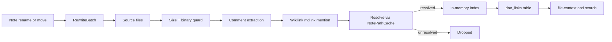

# Coderefs (Hub)

### What this hub is for

- **Purpose**: Keep the coderef system understandable: how we detect code→note links in comments, resolve them to real notes, store them as doc-link edges, and rewrite them safely on note rename/move.
- **Coderefs are one half of bidirectional binding** (see [[Rhizome documentation philosophy]]): coderefs bind **code → note** ("this code follows this contract"); [[Code anchors (Hub)|code anchors]] bind **note → code** ("this contract applies to callers of this symbol"). Together they make docs surface automatically during code work.
- Normative contract: [[coderef-contract|SPEC-0016]] (`docs/specs/technical/coderef-contract.md`).

### Architecture overview

- Scanning is **permissive** (find author intent); rewriting is **stricter** (it mutates source). Keep that asymmetry — see [[Coderefs - rewrite on rename + move]].
- Resolution through `NotePathCache` is the ambiguity boundary: only refs that resolve to a real note become edges; unresolved tokens are silently dropped so ordinary prose never pollutes the graph.

### Reading order (for onboarding)

1. [[Rhizome documentation philosophy]] — bidirectional binding (coderefs vs. code anchors)
2. [[coderef-contract|SPEC-0016]] — normative coderef contract (syntax, scanning, indexing, rewrite musts)
3. [[Coderefs - scanning + indexing]] — scan pipeline, resolution, doc-link surfacing
4. [[Coderefs - rewrite on rename + move]] — rewrite mechanics and the strictness asymmetry
5. `pkg/vault/coderefs/CONTEXT.md` — package scope and invariants
6. `pkg/vault/coderefs/scanner.go` — scan + resolve loop
7. `pkg/vault/coderefs/rewrite.go` — rename/move rewrite

### Key concepts

- [[Coderefs - scanning + indexing]] — three syntaxes, comment families, resolver-backed extraction
- [[Coderefs - rewrite on rename + move]] — comment-scoped, anchor/alias-preserving rewrite
- **Three coderef forms**: wikilinks (`RefKindWikilink`, preferred), markdown links (`RefKindMdLink`), `@mentions` (`RefKindMention`).
- **Comment families**: `slash_line_block`, `block_only`, `hash`, `html`, plus a dedicated Python docstring extractor.
- **CodeRef record**: `SourceFile`, `Language`, `Target` (normalized note path), `Fragment`, `RawTarget`, `Kind`, `Line`, `Snippet`.

### Entry points (code)

- `pkg/vault/coderefs/scanner.go` — `ScanFile`: guard, extract comments, scan wikilinks/mdlinks/mentions, resolve via `NotePathCache`
- `pkg/vault/coderefs/parser.go` — `ExtractCommentBlocks` + language/comment-family routing (`DetectLanguage`)
- `pkg/vault/coderefs/index.go` — `Index`: bidirectional `byNote`/`byFile` maps; `ReplaceFile` atomic per-file update
- `pkg/vault/coderefs/rewrite.go` — `RewriteBatch` / `RewriteCodeRefs`: precompiled, comment-scoped rename/move rewrite
- `pkg/vault/coderefs/config.go` — `Config` (independent `Includes`/`Excludes`; does not inherit vault/note ignore rules)
- `pkg/vault/coderefs/types.go` — `CodeRef`, `RefKind`

### Integration points

- `pkg/app/codeintel/doclinker.go` — `DocLinker.LinksForCode` re-scans and emits `code → note` `doc_links` edges (alias-aware when a store is supplied, so `[[coderef-contract|SPEC-0016]]` in a comment resolves); wired into indexing via `pkg/app/indexing/commands.go`. See [[Indexing pipeline (Hub)]] and [[Code Intel (Hub)]].
- `pkg/vault/cache/service.go` — cache service scans code files into the `Index` and exposes `CodeRefsByNote()` / `CodeRefsByFile()` via `CodeRefProvider`. See [[Cache (Hub)]].
- `pkg/app/cli/rename.go`, `pkg/app/cli/move.go` — invoke rewrite on `rzm note rename` / `rzm note move` when `CodeRefConfig` is set.
- `pkg/app/cli/file_context.go`, `pkg/app/cli/context_text.go`, `pkg/app/cli/graph.go` — coderefs feed file-context linked notes and a graph authority boost. See [[Code Index (Hub)]].

### Invariants / rules of thumb

- **Coderefs live in code** (code → note). Notes should not reference code paths; use [[Code anchors (Hub)|code anchors]] for the note→code direction.
- Prefer markdown links or wikilinks — clickable in IDEs, alias-aware, and auto-rewritten on rename/move. `@mentions` are the lighter-weight fallback.
- **Resolver-backed**: only refs resolving to a real note become edges; unresolved tokens are dropped.
- **Comment-only**: scanning and rewrite operate inside extracted comment/docstring blocks; string literals and code are skipped (unknown extensions fall back to whole-text rewrite — keep `Includes` aimed at code/comment formats).
- **Rewrite is surgical**: trailing boundaries prevent partial replacements (`@MyNote` ≠ `@MyNoteExtra`); anchors and aliases are preserved; image embeds are never rewritten. Correctness > aggressive matching.
- Skip files over 2MB and binary files (null byte in first 8KB).
- For tool selection guidance, see [[Rhizome Codebase Documentation Best Practices (Hub)]] and [[documentation-binding-rationale]].
