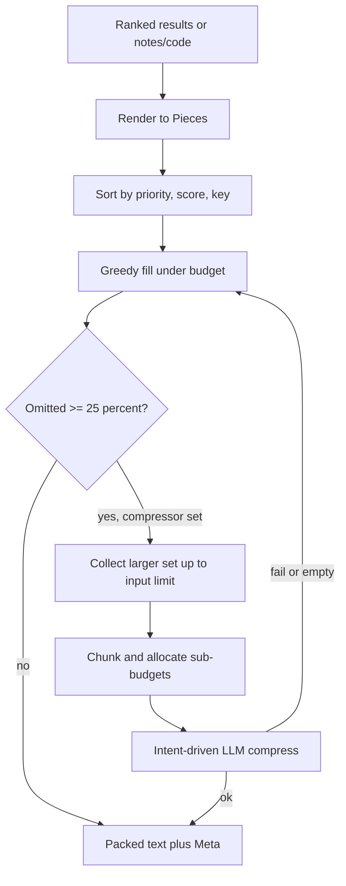

# Contextpack (Hub)

### What this hub is for

- **Purpose**: Understand how Rhizome turns already-ranked results, notes, and code into a single text body that fits a caller's character budget — including deterministic greedy packing, the layered budget surfaces, and when optional LLM compression densifies instead of truncates.
- **Scope**: `pkg/app/contextpack` (the budget-aware packer + compression) and `pkg/app/presentation` (the search-result renderer that produces pieces). Consumes [[Search (Hub)]] output; feeds the `rzm agent` context commands.
- **Not in scope**: retrieval, ranking, and answer role selection — those live upstream in [[Search (Hub)]]. Contextpack never fetches, ranks, or re-orders by relevance; callers hand it pre-rendered pieces whose `Priority` already encodes product semantics.

### Reading order

1. [[Vision + Operating Model (Hub)]] — why budgeted context matters for agents.
2. [[Search (Hub)]] — contextpack is the final packing stage of the search pipeline.
3. [[Contextpack - Budget surfaces]] — the layered budget model (read before touching any default).
4. [[Intent-driven compression]] — when and how the LLM compression path engages.
5. [[pkg/app/contextpack/CONTEXT|Packer module overview]] — entry points + invariants in one screen.
6. `pkg/app/contextpack/pack.go` — `Pack`, `PackDetailed`, `PackWithIntent`, threshold logic.
7. [[pkg/app/presentation/CONTEXT|Presentation renderer overview]] — how ranked results become pieces.

### Architecture overview

Two stages. **Render** (`pkg/app/presentation`) converts ranked results into `Piece` structs. **Pack** (`pkg/app/contextpack`) sorts pieces, greedily fills the budget, and optionally hands a larger collected set to an LLM compressor when deterministic packing would drop too much.



The compression branch is opportunistic: any failure, timeout, or empty response falls back to the deterministic greedy result, so callers always get a usable packet. `rzm agent` standalone CLI disables compression entirely and returns the deterministic body.

### Key concepts

- **Piece**: pre-rendered text block with `Priority` (higher included first), `Score` (tie-breaker), `Key` (stable final tie-break + dedup/debug handle). Callers encode product semantics in `Priority`.
- **Greedy packing** (`Pack`/`PackDetailed`): stable sort on `(Priority desc, Score desc, Key asc)`, then include pieces until the byte budget is exhausted. `Meta` reports `BudgetUsed`, `Trimmed`, included/omitted counts and keys.
- **Budget surfaces**: layered, not one universal default — see [[Contextpack - Budget surfaces]]. Package fallback `DefaultBudgetChars = 70000`; `.rhizome/config.yml` `budgetChars` overrides it; explicit caller `--budget-chars` overrides both; `rzm agent` applies a local `150000` floor; `rzm search --pack` uses its own `6000`-char compact path.
- **Compression threshold**: `CompressionThreshold = 0.25`. Compression only engages when greedy packing would omit ≥25% of pieces (or when a caller sets `AlwaysCompress`). This avoids LLM latency/variance for minor overages where truncation is fine.
- **Intent-driven compression**: the caller's freeform `intent` is the prioritization lens; the LLM is told to preserve high-cost-if-missing content and keep source keys for follow-up retrieval — see [[Intent-driven compression]].
- **Collection vs response budget**: compression collects a *larger* input window (`Compressor.MaxInputChars()`) than the final response budget, then targets the response budget on output. The compressor owns provider token math.

### Entry points (code)

- `pkg/app/contextpack/pack.go` — `Pack` / `PackDetailed` (deterministic greedy) and `PackWithIntent` (threshold-gated compression wrapper); defines `Piece`, `Meta`, `Compressor`, `PackOptions`, `CompressionThreshold`.
- `pkg/app/contextpack/trim.go` — `TrimToBudget` (line-boundary truncation with `…` marker) and `TrimMarkdown` (prefix + "Selected headings" digest).
- `pkg/app/contextpack/compress/llm.go` — `LLMCompressor`: chunking (`splitPieces`), per-chunk budget allocation (`allocateChunkBudgets`), bounded-parallel chunk compression, output-budget enforcement; `NewFromLocalConfig` builds it from vault config.
- `pkg/app/contextpack/compress/prompt.go` — intent-driven and generic prompt templates; preservation-first compression posture; mandates source-key retention.
- `pkg/app/presentation/packer.go` — `DefaultPacker.Pack`: renders ranked results as numbered pieces (header `Priority 1000`, results `Priority 900-rank`), divides budget per-result, then calls `contextpack.Pack`.
- `pkg/app/presentation/code_render.go` — code span / module rendering with head+tail truncation; FTS chunk-body extraction.

### Integration points

- `pkg/app/cli/context_text.go` — `BuildVaultContextText` / `BuildFileContextText` assemble pieces for `rzm agent vault-context` and `file-context`; `packContext` wraps `PackWithIntent`. For code-repo vault context it forces `AlwaysCompress` with a fixed overview `intent`.
- `pkg/app/presentation/packer.go` — implements the `Packer` interface consumed by `pkg/search.Service` for `semantic-query` packed output (see [[Search (Hub)]]).
- `pkg/app/unifiedsearch/run.go` — `rzm search --pack` path; defaults the packed-response budget to `6000` chars when none is given.
- `cmd/agent.go` — `agentCLIBudgetFloor = 150000`; `rzm agent` runs one-shot with **compression disabled** (predictable deterministic output), so the LLM path is MCP/server-only.
- `pkg/llm` — provider abstraction the `LLMCompressor` calls; requires `<PROVIDER>_API_KEY`.

### Configuration

```yaml
# .rhizome/config.yml
budgetChars: 70000   # overrides contextpack fallback for config-aware context tools

compression:
  provider: cerebras            # default
  model: gpt-oss-120b           # default
  timeoutMS: 30000              # default
  reasoningEffort: medium       # default
  maxInputTokens: 0             # 0 => model-derived default
  maxOutputTokens: 0
  reasoningTokenReserve: 0
  chunkChars: 0
  parallelism: 0                # 0 => default of 4
```

Compression needs `<PROVIDER>_API_KEY` (e.g. `CEREBRAS_API_KEY`); without a key, `NewFromLocalConfig` returns nil and packing stays deterministic.

### Invariants / rules of thumb

- **Priority-first, deterministic**: selection is `(Priority desc, Score desc, Key asc)`, stable. Same inputs → same packet (matters for agent diffs, tests, continuation tokens).
- **First piece always included**: even if it exceeds budget it is trimmed to fit, so agents always get the caller's header/contract, never an empty packet.
- **Budget is in chars/bytes**, not tokens; token conversion belongs at provider boundaries inside the compressor.
- **Compression is opportunistic and never fatal**: any error/timeout/empty response falls back to the deterministic packet; the non-fatal error is surfaced in metadata only.
- **Compression preserves source keys**: summarized/merged content must keep `Key`/path markers so agents can fetch raw material later.
- **Layered budgets, not one default**: document `70k` for the packer package, `150k` only for `rzm agent` floor behavior, `6k` only for `rzm search --pack`; an explicit caller budget is the contract for that call. The old "default 50k" is stale.
- **Contextpack does not retrieve or rank**: callers pass already-rendered pieces; `presentation` may do bounded reads for already-ranked results only.

### Related

- [[Search (Hub)]] — produces the ranked results contextpack packs.
- [[Contextpack - Budget surfaces]] — the layered budget model in detail.
- [[Intent-driven compression]] — compression contracts and intent prioritization.
