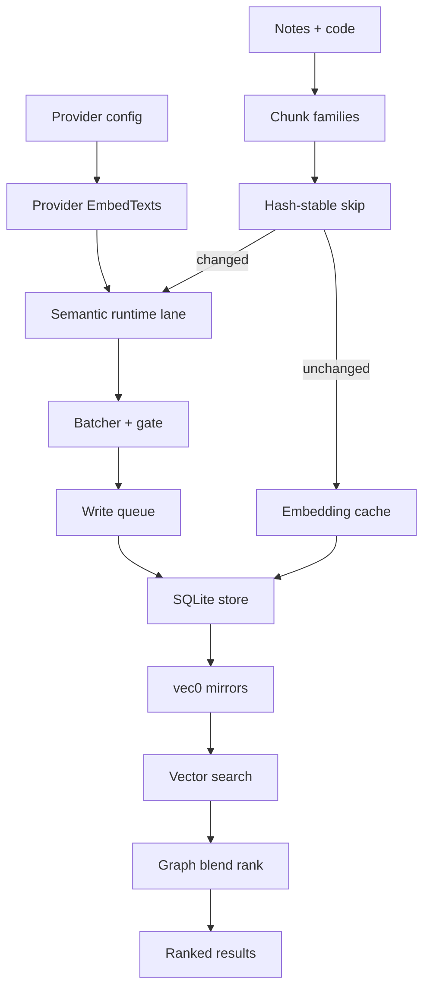

# Embeddings (Hub)

### What this hub is for

- **Purpose**: Safely evolve Rhizome's semantic embeddings — how text becomes vectors (provider contract + chunk families), how they persist (SQLite `vec0` stores under the unified DB), how sync stays incremental and hash-stable, and how similarity blends with graph signals at rank time.
- **Boundary**: this hub owns the semantic-vector surface. For end-to-end indexing phase ownership use [[Indexing pipeline (Hub)]] and [[Indexing pipeline - Phase ownership matrix]]; for provider lane execution rules use [[semantic-runtime-lane-policy]]; for primary chunk identity/invalidation use [[primary-semantic-chunks-and-noderef-search]]; for downstream retrieval/ranking use [[Search (Hub)]].

### Architecture overview

- **Provider** (`pkg/search/embeddings/provider.go`): one `EmbedTexts` + `Dimensions` contract; OpenAI / Voyage / Ollama / deterministic-test behind `NewProvider`.
- **Chunk families** decide what text gets embedded (ontology-node primary, doc-section fallback, code anchor/module primary). See [[Embeddings - indexing pipeline]].
- **Hash-stable skip**: chunk text + source hashes gate re-embedding; unchanged chunks reuse cached vectors.
- **Shared runtime lanes** (`pkg/app/semanticruntime`): the only indexing-time provider path; enforces concurrency gate, packer ceilings, and shared-node execution per [[semantic-runtime-lane-policy]].
- **SQLite store** (`pkg/search/embeddings/sqlite`, code in `codeindex/sqlite`): relational chunk/blob rows mirrored into `vec0` virtual tables (`emb_chunk_embeddings_vec_d<dims>`) for cosine search; lives in the unified `.rhizome/db.sqlite`.
- **Graph blend** (`pkg/search/embeddings/rank.go`): additive direct-link / two-hop / shared-tag bonus over raw cosine similarity.

### Reading order (for onboarding)

1. [[Embeddings - providers + configuration]] — provider contract, defaults, batching/concurrency knobs
2. `pkg/search/embeddings/CONTEXT.md` — module entry points and the dimension invariant
3. [[Embeddings - indexing pipeline]] — primary chunk families and incremental hash-stable sync
4. [[semantic-runtime-lane-policy]] — shared lane rules (no temporary intent-only/provider-only lanes)
5. `pkg/app/semanticruntime/CONTEXT.md` — lane construction, gates, packer ceilings
6. [[Embeddings - SQLite store + locking hazards]] — metadata validation, vec mirrors, WAL/write-lock safety
7. `pkg/search/embeddings/sqlite/store.go` — schema, vec-mirror ensure, serialized writes
8. [[Embeddings - ranking + graph blend]] — semantic↔graph weight split
9. [[Indexing pipeline (Hub)]] and [[indexing-workflow]] — how embeddings fit the broader index run

### Key concepts

- [[Embeddings - indexing pipeline]] — staged discover → upsert meta → project nodes → chunk → embed-changed → persist
- [[Embeddings - providers + configuration]] — provider/model/dimension selection, note vs code model split
- [[Embeddings - SQLite store + locking hazards]] — store contracts and rebuild/recovery rules
- [[Embeddings - ranking + graph blend]] — additive graph layer over cosine similarity
- [[semantic-runtime-lane-policy]] — compatible-lane execution policy
- [[Search - Semantic embedding sync invariants]] — sync-marker and drain ordering invariants

### Chunk-family quick map

- `ontology_node`: primary note semantic surface in ontology-ready vaults (typed roots, section/embedded nodes, internal untyped-note fallback).
- `ontology_node`: source-owned primary chunks for note roots and embedded nodes, combining authored body with bounded identity and ancestor context.
- `doc_section`: raw authored-section path used **only** when ontology projection is unavailable.
- code anchor/module chunks: primary code surfaces, enriched with bounded doc labels + factual surface/named signals; call facts stay in structural lanes so code can stream before call-graph barriers.

### Entry points (code)

- `pkg/search/embeddings/provider.go` — `Provider` interface (`EmbedTexts`, `Dimensions`); `ContextTokenProvider` optional
- `pkg/search/embeddings/provider_factory.go` — `NewProvider` switch (openai default, voyage, ollama, test, none)
- `pkg/search/embeddings/config.go` — provider defaults, note vs code model split, `DefaultBatchSize`/`DefaultMaxConcurrent`
- `pkg/search/embeddings/chunker.go` — heading-aware chunking with frontmatter summary inclusion
- `pkg/search/embeddings/batcher.go` — `BatchExecutor` concurrency/semaphore + dynamic batch sizing
- `pkg/search/embeddings/indexer.go` — legacy raw-note scan → chunk → embed → persist (ontology-unavailable path)
- `pkg/search/embeddings/sqlite/store.go` — note embeddings store: schema, `vec0` mirrors, serialized writes
- `pkg/search/embeddings/codeindex/sqlite/store.go` — code embeddings store (same vec-mirror pattern)
- `pkg/search/embeddings/rank.go` — `RankRelated` blends cosine + graph bonuses
- `pkg/app/semanticruntime/runtime.go` — shared provider lane / gate construction

### Integration points

- `pkg/app/indexing.RunUnifiedCore` — decides which configured semantic domains (code, ontology body, compatibility notes, intent exemplar) run for a batch index; open stores via `obsidian.OpenIntelStore*` against the unified DB.
- `pkg/search/semantic.OntologyNodeSyncer` — renders source-owned ontology-node primary chunks and writes chunks/embeddings through the shared writer; see [[primary-semantic-chunks-and-noderef-search]].
- `pkg/app/indexwriter/writer.go` — batches semantic writeback before SQLite (no per-task durable write).
- [[Code Index - Unified SQLite DB]] — embeddings share the single `.rhizome/db.sqlite` handle with code-index and graph data.
- [[Search (Hub)]] — vector hits feed retrieval/ranking; semantic similarity is one evidence source, not the whole ranking.

### Invariants / rules of thumb

- Provider dimensions must match index dimensions; provider/model/dimension changes require a **safe rebuild**, never mixed-state reuse.
- Chunk re-embedding is hash-gated (chunk text hash + source content hash + node fingerprint + provider/model + schema signature); unchanged chunks reuse cached vectors.
- `vec0` mirror tables are the query-time search input; relational embedding blobs are transitional storage.
- All long-running write paths serialize through the store write lock (shared `sqlstore.Runtime` mutex); tx-lock mode is injected at open time, not mutated globally.
- Never remove WAL/SHM sidecars while another process holds the DB open; prefer embeddings-domain repair before full DB removal to preserve expensive vectors.
- Last-sync markers are written **only after** streamed ontology primary-chunk writes drain, so an interrupted flush does not make the next run skip unfinished work.
- Shared semantic runtime lanes are the only indexing-time provider path; temporary intent-only/provider-only lanes are forbidden.
- Graph blend is additive and tunable; bonuses stay light enough that exact lexical/handle matches are not drowned out.
- For large edits or broad churn, one deliberate `rzm index` resync is usually safer and cheaper than many small incremental updates.
