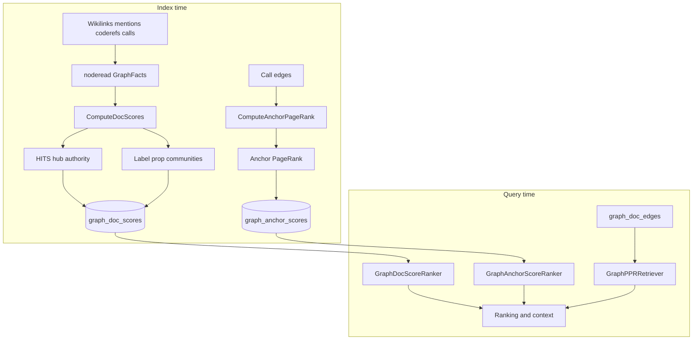

# Graph (Hub)

### What this hub is for

- **Purpose**: Understand and safely change Rhizome's graph analysis — the pure graph algorithms (`pkg/search/graphalg`) and the persistence/build layer (`pkg/search/graphdb`) that turn indexed wikilinks, mentions, coderefs, and call edges into HITS hub/authority scores, communities, and anchor PageRank, and how those signals reach ranking, retrieval, and `graph` commands.
- **Scope boundary**: This hub covers the **unified doc graph** persisted in the intel DB (notes + code, scored over `noderead.GraphFacts`). For the separate **Obsidian vault graph** (recency cascade, bridges, weak components computed in-memory from wikilinks) see `pkg/vault/obsidian/graph.go` and [[Graph analysis (wikilinks + communities + authority)]]. The two share the "graph" name but are distinct subsystems.

### Architecture overview

Edges and call topology are persisted at index time; `ComputeDocScores` and `ComputeAnchorPageRank` run in the graph phase and write read-only score tables. Query time only reads those tables, plus runs personalized PageRank over a bounded induced subgraph for seed-local diffusion.

### Reading order

1. [[Indexing pipeline - Graph signals (doc scores + anchor PageRank)]] — what the persisted signals are and their build/delete contracts.
2. [[pkg/search/graphalg/CONTEXT|Graph algorithms]] — the stateless algorithm layer (HITS, PageRank, PPR, label prop, surprise, paths).
3. [[pkg/search/graphdb/CONTEXT|Graph persistence]] — how indexed facts become persisted scores + edges.
4. [[Graph analysis (wikilinks + communities + authority)]] — the separate Obsidian vault graph (recency, bridges, components).
5. [[Search (Hub)]] — where graph evidence merges with lexical/vector evidence in ranking.

### Key concepts

- **HITS (doc authority/hub)** — `ComputeHITS` runs 30 alternating, L2-normalized iterations over a directed **doc-domain** adjacency (wikilinks, mentions, coderefs). Code→code `calls` edges are deliberately excluded: HITS models knowledge curation, not structural coupling. Produces `Hub` + `Authority` per doc path.
- **Communities** — `weightedLabelPropagation` (in `graphdb`) runs degree-normalized label propagation over the **full undirected** adjacency (including calls), 20 iterations, lexical tie-break for determinism. The pure `graphalg.LabelPropagation` is the unweighted set-based variant. Same-community membership becomes a ranking boost.
- **Anchor PageRank** — `PageRank` (damping 0.85, 30 iterations, dangling-mass redistribution) over the anchor→anchor `calls` graph built in `ComputeAnchorPageRank`. Boosts frequently-called code anchors.
- **Personalized PageRank (PPR)** — query-time random-walk-with-restarts (`PersonalizedPageRank`, damping 0.85, 15 iters) seeded from query seeds over a bounded induced subgraph. Powers seed-local auto-expansion via `GraphPPRRetriever`, not persisted.
- **Confidence weighting** — `ConfidenceValue`/`ConfidenceCost`/`ConfidenceSurpriseMultiplier` map edge confidence labels (`inferred` 0.7, `ambiguous` 0.2) and numeric scores into 0..1; used for edge weights, path cost, and surprise scoring.
- **Surprising connections** — `FindSurprisingConnections` scores edges by cross-community / cross-type / peripheral→hub / low-authority signals (Mode 1), falling back to edge betweenness centrality (Brandes) when no scores exist. Skips explicit author links (wikilink/mdlink/note_link) and pure-hub endpoints.
- **Shortest path** — `ShortestPath` finds the lowest-confidence-cost route (then fewest hops) between two doc nodes over the undirected edge set, bounded by max hops.

### Entry points (code)

- `pkg/search/graphalg/hits.go` — `ComputeHITS` directed hub/authority iteration
- `pkg/search/graphalg/labelprop.go` — `LabelPropagation` unweighted community labels
- `pkg/search/graphalg/pagerank.go` — `PageRank` over a directed call graph
- `pkg/search/graphalg/ppr.go` — `PersonalizedPageRank` random-walk-with-restarts
- `pkg/search/graphalg/surprise.go` — `FindSurprisingConnections` community/bridge scoring
- `pkg/search/graphalg/betweenness.go` — `edgeBetweennessFallback` Brandes bridge detection
- `pkg/search/graphalg/shortest_path.go` — `ShortestPath` + `ResolvePathFuzzy`
- `pkg/search/graphalg/confidence.go` — confidence → weight/cost/surprise helpers
- `pkg/search/graphdb/doc_scores.go` — `ComputeDocScores` (HITS + weighted communities) + incremental `UpsertNoteWikilinkEdges`
- `pkg/search/graphdb/doc_edges.go` — `RebuildWikilinkEdgesForPaths` / `RebuildAllNoteWikilinkEdges` edge maintenance
- `pkg/search/graphdb/anchor_pagerank.go` — `ComputeAnchorPageRank` over `intel_edges(kind='calls')`
- `pkg/search/relevance/graph_doc_score_ranker.go` — `GraphDocScoreRanker` injects `graph_hits_authority`, `graph_hits_hub`, `same_community`, `graph_edge_confidence` evidence
- `pkg/search/relevance/graph_anchor_score_ranker.go` — `GraphAnchorScoreRanker` injects `graph_anchor_pagerank` evidence
- `pkg/search/retrieval/graph_ppr.go` — `GraphPPRRetriever` query-time diffusion over induced doc graph

### Integration points

- `pkg/app/indexing/unified_post.go` — `compute_graph` phase: rebuild wikilink edges, `ComputeDocScores` → `ReplaceGraphDocScores`, `ComputeAnchorPageRank` → `ReplaceAnchorScores`.
- `pkg/app/bootstrap/schedulers.go` — live watcher recompute of edges/scores after note/code changes.
- `pkg/anchors/sqlite/graph_doc_scores.go`, `pkg/anchors/sqlite/anchor_scores.go` — persisted `GraphDocScore` / `AnchorScore` rows + read accessors (`GraphDocScoresByPaths`, `AnchorScoresByIDs`).
- `cmd/graph_surprises.go` — `rzm graph surprises` over persisted facts + scores via `FindSurprisingConnections`.
- `cmd/graph_path.go` — `rzm graph path` via `ResolvePathFuzzy` + `ShortestPath`.
- `cmd/graph_communities.go` / `pkg/app/mcp/tool_community.go` — community summaries (`community_list`).
- Graph evidence merges with lexical/vector evidence in [[Search (Hub)]]; semantic blending detail in [[Embeddings - ranking + graph blend]]. Web graph responses use their own cache; the unused [[AnalysisCache (backlinks + graph memoization)]] layer has been removed.

### Invariants / rules of thumb

- **graphalg is pure**: algorithms take adjacency/score maps and return maps — no I/O, no store access. Keep persistence in `graphdb`.
- **HITS uses doc-domain edges only**; `calls` edges are excluded from HITS but included in communities, PPR, and degree counts.
- **Embedded/section endpoints roll up to their owner note** for the doc-level score table (`graphScoreDocNode`).
- **Persisted scores are read-only request inputs** once written; structure can return without scores, and scores backfill asynchronously.
- **Note deletions must clear persisted edges before recompute** (edge rebuild replaces per-path edge sets, including empty sets to clear stale links).
- **Determinism**: label propagation and surprise/path results break ties lexically so repeated runs are stable.
- **Recompute is gated**: the graph phase only runs when notes changed or code was indexed; wikilink edges depend on notes only.

### Tests + fixtures

- `pkg/search/graphalg/ppr_test.go` — PPR diffusion behavior
- `pkg/search/graphalg/shortest_path_test.go` — path selection + fuzzy resolution
- `pkg/search/graphalg/surprise_test.go` — surprise scoring + betweenness fallback
- `pkg/search/graphdb/doc_scores_test.go` — doc-score build over intel tables
- `pkg/search/graphdb/anchor_pagerank_test.go` — anchor PageRank over call edges
