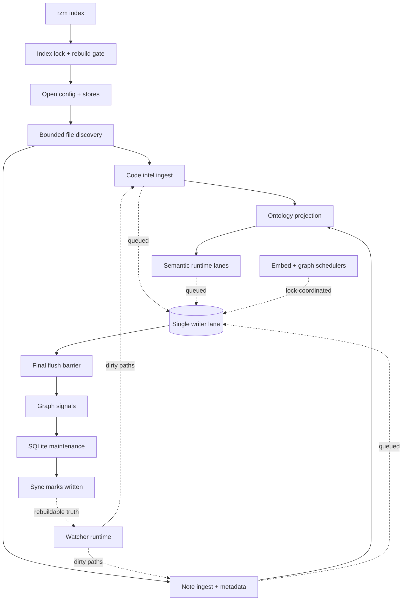

# Indexing pipeline (Hub)

### What this hub is for

- **Purpose**: One place to understand and safely change how Rhizome turns a vault + code roots into persisted indexes, ontology-derived semantic evidence, graph scores, and live-updated state.
- **Scope**: batch `rzm index`, live watcher refresh, file discovery, note/code ingest, source-owned primary semantic chunks, queued SQLite writes, graph analysis, maintenance, and cross-process index locking.
- **Routing rule**: this hub points; the subpages own detail. [[Indexing pipeline - Phase ownership matrix]] owns phase/table/test boundaries, and [[Index lock and background coordination runbook]] owns contention recovery. Governing specs are [[indexing-workflow]] (SPEC-0036, product), [[indexing-pipeline-architecture]] (SPEC-0012, architecture), [[semantic-runtime-lane-policy]] (SPEC-0044), and [[indexing-observability-and-maintenance-policy]] (SPEC-0047).

### Architecture overview

`rzm index` is the authoritative batch builder; the watcher runtime is an optimization layer that drives the same barriers incrementally on save. Read/parse/embed work fans out widely; durable SQLite writes funnel through **one queued writer lane** under bounded backpressure; cross-file work waits behind explicit barriers.

Three layers sit under that flow:

1. **Persistent indexes (SQLite)** — rebuildable build artifacts in `.rhizome/db.sqlite`: code intel + edges, note `emb_*` embeddings, code `code_*` embeddings, ontology nodes/cards, and persisted graph scores. Start at [[Code Index - Unified SQLite DB]] and [[semantic-code-index-spine]].
2. **In-memory hot cache** — `cache.Service` keeps note content + derived metadata hot and supplies incremental freshness while a process runs. See [[Vault cache service (Service)]].
3. **Derived signals** — some memoized in-memory (keyed by cache version), some persisted to SQLite for ranking. See [[Graph analysis (wikilinks + communities + authority)]] and [[Indexing pipeline - Graph signals (doc scores + anchor PageRank)]].

**Operating rule**: persistent indexes are rebuildable truth; live updating is an optimization on top.

### Reading order

1. [[indexing-workflow]] — user-facing batch/live/rebuild/lock behavior (SPEC-0036)
2. [[indexing-pipeline-architecture]] — staged-parallel-before-commit contract (SPEC-0012)
3. [[Indexing pipeline - End-to-end walkthrough]] — narrative discovery → ingest → embed → graph
4. [[Indexing pipeline - rzm index orchestration]] — `RunUnifiedCore` ordering + convergence boundary
5. [[Indexing pipeline - Phase ownership matrix]] — per-phase inputs/outputs/owners/tables/barriers/tests
6. [[semantic-runtime-lane-policy]] — shared provider lanes, no ad hoc batchers (SPEC-0044)
7. [[primary-semantic-chunks-and-noderef-search]] — source-owned primary chunk context, invalidation, and NodeRef provenance
8. [[Index lock and background coordination runbook]] — `.rhizome/index.lock`, priority, heartbeats, recovery
9. [[Indexing pipeline - Live updating (watcher runtime)]] — dirty-drain epochs, leader/follower
10. [[Indexing pipeline - Performance tradeoffs + guardrails]] — what may move earlier vs stay barriered
11. `pkg/app/indexing/unified.go` — the `RunUnifiedCore` phase sequence in code

### Key concepts

- [[Use a single queued writer lane for SQLite-backed indexing writes]] — WAL commits one writer; batching/flush/instrumentation live in one lane.
- [[Use bounded backpressure in indexing instead of adding writer concurrency]] — finite queues; pressure propagates upstream instead of hiding in memory.
- [[Preserve explicit correctness barriers in the indexing pipeline]] — `FlushAndWait`/`CloseAndWait`/`MarkNoteLastSync`, call-edge rebuild, and graph recompute gate on final cross-file state.
- [[Indexing pipeline - Concurrency + batching requirements]] — small per-path txns, real bulk txns, shared write mutex, cross-process lock.
- Chunk-family ownership: typed-note primary bodies in `ontology_node`; raw `doc_section`/`authored_section` only for ontology-unavailable compatibility.
- Freshness contract: `MarkNoteLastSync` is success-only; an interrupted final flush forces the next run to retry unfinished semantic work. `last_sync` is diagnostic wall-clock; skip decisions are source-generation/high-water based.
- Primary-chunk freshness is part of ordinary semantic convergence: source/context/format/provider fingerprints plan changed work, and semantic rebuild repairs suspect state.

### Entry points (code)

- `cmd/index.go`, `cmd/index_unified.go` — CLI flags, rebuild/status/mode routing, lock acquisition
- `pkg/app/indexing/unified.go` — `RunUnifiedCore`, the full batch phase sequence
- `pkg/app/indexing/semantic_core.go` — raw-note embedding compatibility helper used when ontology is unavailable
- `pkg/app/indexwriter/writer.go` — `indexwriter.New` / `Writer.run`, the single durable write lane
- `pkg/app/indexingpipe/files.go` — `ProcessFiles`, bounded discovery/read workers
- `pkg/app/semanticruntime` — `PolicyFor` / `Runtime.EnsureLane`, shared provider lanes + gate
- `pkg/search/semantic/` — primary code and ontology-node chunk synthesis + sync
- `pkg/search/graphdb` — `ComputeDocScores`, `ComputeAnchorPageRank` (persisted graph signals)
- `pkg/app/indexing/lock.go`, `pkg/vault/indexlock/lock.go` — `TryAcquireIndexLock` and the cross-process lock primitive
- `cmd/runtime_helpers.go` — `runBackgroundIndex`, best-effort boot-time index on the live leader
- `pkg/app/bootstrap/live.go`, `pkg/app/bootstrap/schedulers.go` — `LiveRuntime` leader work + embed/graph schedulers
- `cmd/index_timings.go`, `pkg/indexingperf/collector.go` — `--timings` phase/queue/provider/DB diagnostics
- `pkg/app/indexing/maintenance.go`, `pkg/anchors/sqlite/maintenance.go` — freelist-gated `VACUUM`; routine `ANALYZE`/`PRAGMA optimize`/checkpoint

### Integration points

- [[Code Index (Hub)]] — the unified `.rhizome/db.sqlite` spine the writer lane targets
- [[Embeddings (Hub)]] — semantic runtime lanes, chunk families, provider/storage contracts ([[Embeddings - indexing pipeline]], [[Embeddings - SQLite store + locking hazards]])
- [[Cache (Hub)]] — watch → dirty → refresh, used heavily by the watcher runtime ([[Dirty tracking + Refresh semantics]], [[Ignore + exclude rules]], [[AnalysisCache (backlinks + graph memoization)]])
- [[Code anchors (Hub)]] — note → code bindings; anchor scopes recompute after ingest
- [[Coderefs (Hub)]] — code → note links contributed during code ingest
- [[Graph (Hub)]] — vault graph analysis feeding persisted doc scores + anchor PageRank
- [[Watcher design + degraded mode]] — WatchHub events, stale-resync fallback, degraded mode
- [[LiveRuntime (async server bootstrap)]] — async capability init for `rzm serve` / `rzm web`; servers that keep state warm
- [[Go anchor - Indexing pipeline (rzm index)]] — code anchors that attach these docs to the implementation
- `cmd/serve.go`, `cmd/graph_web.go` — server commands that run `LiveRuntime` + best-effort background index
- `pkg/app/bootstrap/lane/CONTEXT.md` — the runtime indexing lane (single lock holder inside a vault runtime)
- `pkg/vault/indexlock/CONTEXT.md` — index lock used by background indexing + schedulers
- [[docs/specs/product/code-intel|code-intel]] — product framing for code-aware retrieval the index feeds

### Invariants / rules of thumb

- All high-volume durable writes go through the one queued writer lane; cold/isolated writes may hit stores directly, but hot loops never invent side-channel write paths.
- Queues are bounded: backpressure slows producers; the fix for write-bound runs is better batching/overlap/staging, not more writer concurrency.
- Code anchors are ingested before notes so note mentions resolve; `FlushAndWait` precedes metadata/ontology readers.
- Call-edge-sensitive semantic planning, reverse-index, and graph recompute stay behind the final drain barrier; only call-insensitive code chunks stream early.
- Provider-backed code/note/ontology-primary/intent work uses `semanticruntime` compatible lanes (key = provider/model/endpoint/dimensions); never add ad hoc provider batchers.
- Cross-process indexers coordinate through `.rhizome/index.lock`; interactive `rzm index` requests priority via `.rhizome/index.priority` and background work yields. Never delete a live, fresh lock to fix contention.
- Routine maintenance is cheap (`ANALYZE`, `PRAGMA optimize`, checkpoint); full `VACUUM` is manual or freelist-gated only — never elapsed-time or WAL-size triggered.
- `--timings` phase labels map to real barriers; new high-cost work lives under an existing truthful phase or adds a named `runPhase`. A repeated `auto.*` DB-write line means missing instrumentation.
