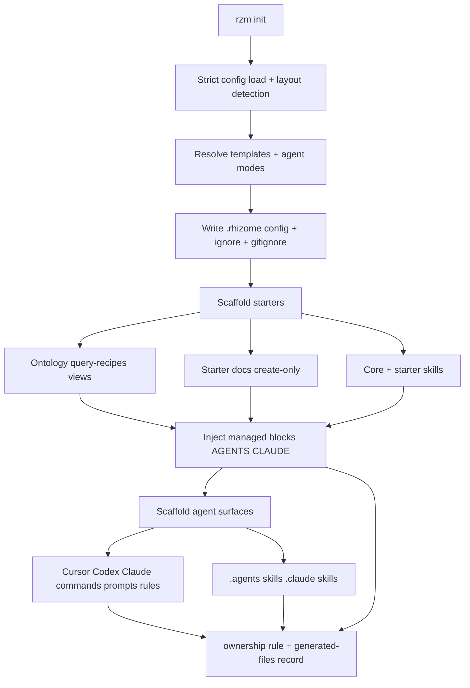

# Init (Hub)

## What this hub is for

- **Purpose**: Understand how `rzm init` (`pkg/app/cli/init`) makes a repo agent-ready without surprising the user: strictly load canonical config, detect docs/code layout, write `.rhizome/config.yml` settings plus `.rhizome/workflows.yml` starter state (+ `.gitignore`/`ignore`), resolve which agent surfaces participate, scaffold workflow starters, inject managed Rhizome guidance into `AGENTS.md` / `CLAUDE.md`, and write Cursor/Codex/Claude/`.agents` helper artifacts and skills — all through one ownership rule that updates only files nobody edited.
- **Boundary**: init owns project-local setup and managed-template refresh. It does not own runtime indexing, MCP server startup, MCP config files (no longer scaffolded), or arbitrary agent files outside Rhizome-managed fences and `rhizome-*` artifacts.

## Architecture overview

`rzm init` runs one pipeline (`Run` in `run.go`) with two paths, first run and rerun, that share `resolve` and `apply` in `rerun.go`. A rerun shows the setup and a change list, asks once in a terminal, and `--check` reports without writing. Every generated file flows through `syncGeneratedFiles`, which plans the targets and applies one ownership rule against `.rhizome/generated-files.yml`, so reruns refresh untouched Rhizome files and ask only about edited ones.

## Reading order

1. [[init-starter-workflow]] (SPEC-0038) — user-facing init, rerun, and ownership product contract
2. [[agent-surface-integration-modes]] (SPEC-0045) — `auto|on|off` surface resolution before any write
3. [[init-template-architecture]] (SPEC-0039) — embedded source families, managed fences, collision/refresh semantics
4. [[RHIZOME.md templates + rzm init]] — how the core guidance block is rendered and injected
5. [[Init - Agent surfaces (prompts, commands, skills)]] — per-harness artifact matrix and ownership modes
6. [[Init - MCP config scaffolding]] — current state: init no longer writes MCP config
7. [[Keep prompt targets command-backed until prompt semantics diverge]] — why prompts reuse the command family
8. [[pkg/app/cli/init/CONTEXT|Init module contract]] — terse entry points and invariants

## Key concepts

- **Surface mode resolution** (SPEC-0045): each harness (Cursor, Codex, Claude, `.agents/skills`, `AGENTS.md`) resolves to enabled/disabled from `auto|on|off`. `auto` = stored preference then detection; `on` forces; `off` opts out and beats implied shared-surface fallback. Any enabled surface implies `AGENTS.md` (unless `off`) and usually `.agents/skills`.
- **Managed blocks**: the core block lives between `<!-- BEGIN/END RZM INIT RHIZOME BLOCK -->`; each active starter adds `<!-- BEGIN/END RZM INIT TEMPLATE BLOCK: <template> -->`. Legacy fences and old standalone `RHIZOME.md` redirects are stripped before re-rendering; prose outside fences is byte-preserved.
- **Workflow starters**: `core`, `agentic-engineering`, `complex-domain`, `action-items` live under `templates/starters/<id>/`. Each `template.yaml` declares `requires`, `activatesByDefault`, and `installedAssetTypes`; `resolveTemplateSet` expands explicit choices into the effective set. `spec-driven` is legacy migration input only. Assets are grouped by install destination: `repo/` (installs into the target repo root, e.g. `repo/docs/**` → `docs/**`), `rhizome/` (→ `.rhizome/`: `ontology/`, `query-recipes/`, `views/`), and `agents/` (`skills/` → `.agents/skills` and `.claude/skills`, `AGENTS.md` → managed block, `skill-overlays/`).
- **Ownership modes** (see [[Init - Agent surfaces (prompts, commands, skills)]]): managed agent-doc blocks; `rhizome-`-prefixed whole-file helper artifacts; skill directories (scripts written executable); create-only starter scaffold docs.
- **Ownership rule**: missing files are created, files matching their fingerprint in `.rhizome/generated-files.yml` are updated, and edited files are asked about in a terminal or kept and listed otherwise. Unrecorded differing files share one grouped question; managed blocks count as Rhizome's.
- **Command-backed prompts** (decision): one helper loader (`loadCommandTemplates()`) feeds Cursor commands and Codex/Claude prompts+commands. `templates/commands/*` is currently empty, so this is a valid zero-helper state, not a failure.

## Entry points (code)

- `run.go` — `Run` orchestrates detect → resolve → write config → scaffold → inject → surfaces; three branches share writers
- `detect.go` — `DetectLayout`: strict canonical-config load, language/root detection, TS/JS monorepo package-root preservation, and harness detection
- `detect_notes.go` — scored markdown-dir detection for knowledge roots
- `first_run.go` — first-run findings, the workflow and search-key questions, and the setup summary
- `rerun.go` — `resolve`/`apply`, the rerun summary and change list (settings, detection drift, generated files), suggestions, and `--check`
- `settings.go` — the four-section settings menu (what gets indexed, semantic search, agents, workflow)
- `skips.go` — skip suggestions for bulky checked-in content and the `# rhizome: suggested skips` section of `.rhizome/ignore`
- `template.go` — `normalizeTemplateNames`, `resolveTemplateSet`, `planTemplateScaffold`; unknown-name and target-path collision rejection
- `helper_templates.go` — `embed.FS` loader for skills, starter docs/ontology/query-recipes/views, managed-doc/embed expansion, skill-collision detection
- `rhizome_md.go` — `renderRhizomeMd`, `buildManagedRhizomeBlock`, `stripAllManagedTemplateBlocks`, `renderAgentHarnessDoc`
- `agent_surfaces.go` — `planAgentSurfaces`, `planSkillSurface`, `planStaleSkills`, `cleanupStaleArtifacts`, `SkippablePathError`
- `file_plan.go` — `syncGeneratedFiles`, `applyFilePlan`, classification, the terminal question UI
- `generated_files.go` — the `.rhizome/generated-files.yml` record, fingerprints, and folding of legacy skill markers
- `write_config.go` — `ensureRhizomeGitIgnore` / `ensureIgnoreFile` / config writers
- `skill_overlay.go` — `prepareSkillOverlayPreflight`: validates starter skill overlays before writes
- `diff/` — unified diffs shown when someone asks to see an update

## Source-of-truth paths

- `docs/rhizome-md-templates/*` — core managed Rhizome guidance chunks (single source; embedded via `templates.go`)
- `pkg/app/cli/init/templates/commands/*` — helper template family reused for Cursor commands and Codex/Claude prompts+commands; currently empty (valid zero-helper state)
- `pkg/app/cli/init/templates/skills/markdown/*` — core skills installed independent of starter
- `pkg/app/cli/init/templates/starters/<id>/` — per-starter `template.yaml` + `repo/` (installs into the target repo root, e.g. `repo/docs/**` → `docs/**`), `rhizome/` (→ `.rhizome/`: `ontology/`, `query-recipes/`, `views/`), and `agents/` (`skills/` → `.agents/skills` and `.claude/skills`, `AGENTS.md` → managed block, `skill-overlays/`)
- `pkg/app/cli/init/templates/starters/<id>/agents/AGENTS.md` — template-specific managed block injected into `AGENTS.md` / `CLAUDE.md`

## Integration points

- `cmd/init.go` — CLI flag parsing for `rzm init`; pushes `RunOptions` into `Run`
- `pkg/vault/obsidian` + `pkg/vault/config` — `.rhizome/config.yml` and `.rhizome/workflows.yml` load/save, `LocalConfig`, agent prefs, workflow-template state
- `pkg/app/cli/init/template_includes.go` — reconciles config note includes after starter docs land
- [[Agentic Engineering starter (Hub)]] / [[Agent Skills (Hub)]] — downstream consumers of the Agentic Engineering starter and installed skills
- [[Agent-ready workflows (prompts, commands, skills)]] — the prompts/commands/skills packaging vision init scaffolds

## Invariants / rules of thumb

- Edit source templates, never generated agent surfaces; keep repo-specific guidance outside managed fences.
- Resolve `auto|on|off` surface modes (SPEC-0045) before any managed write; `off` always wins and blocks shared-surface fallback.
- At most one core block and one block per active starter in each agent doc; reruns replace blocks rather than append.
- Core and starter skill names must not collide; collision is a hard error before the colliding skill is written (`loadAllSkillTemplates`).
- Starter scaffold target-path collisions fail unless byte-identical; unknown starter names fail before writes.
- Starter docs are create-only on rerun; `--refresh-docs` applies the ownership rule to existing starter docs.
- Prompt target dirs reuse `templates/commands/*`; keep command-backed until prompt semantics diverge per [[Keep prompt targets command-backed until prompt semantics diverge]].
- A version someone declined is recorded in `.rhizome/generated-files.yml` and offered again only when a newer version ships.
- Cleanup removes only files the record proves Rhizome wrote and nobody edited (plus `rhizome-`-prefixed command artifacts); it never sweeps user files. Broken harness-dir symlinks are skipped per file with a warning; root docs and config errors stay fatal.
- Init does not create or clobber MCP config files; MCP setup guidance lives in managed agent docs (see [[Init - MCP config scaffolding]]).
- New committed `.rhizome/` files must be allowlisted in `rhizomeGitIgnoreBody` (`write_config.go`) or they stay ignored.
