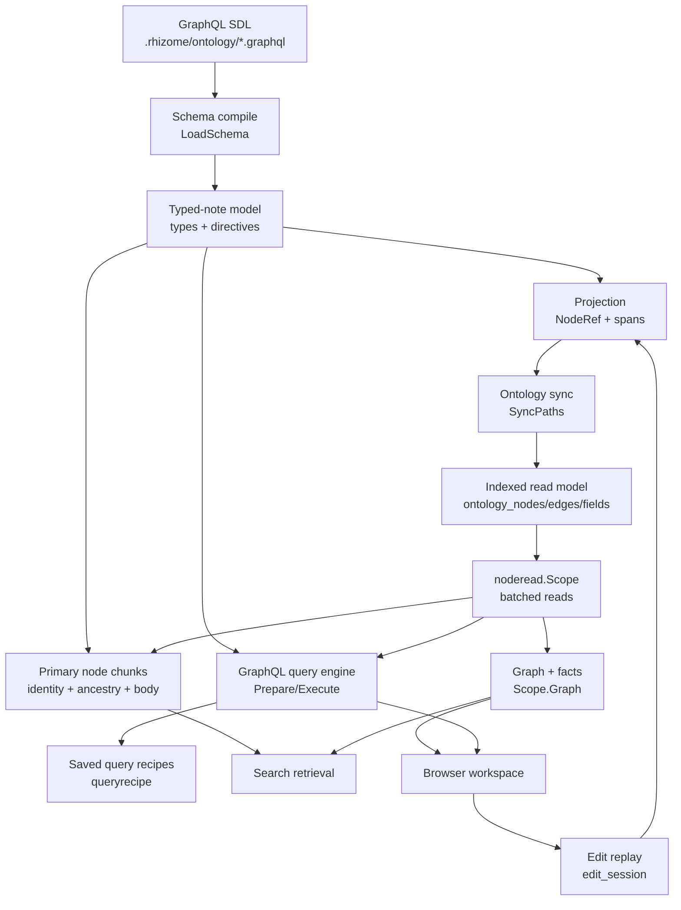
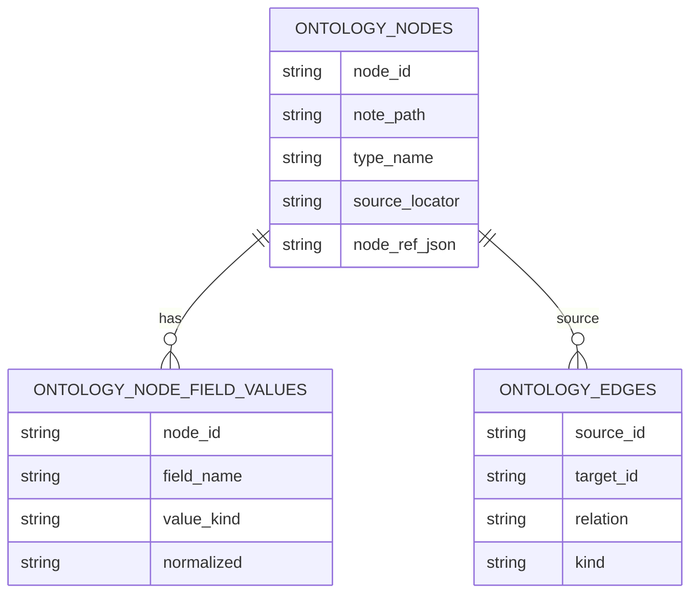

# Ontology (Hub)

### What this hub is for

- **Purpose**: orient anyone (human or agent) who edits `.rhizome/ontology/*.graphql`, consumes typed notes via `file_context` / GraphQL queries / recipes, navigates the graph or browser, or extends ontology retrieval.
- **One-line model**: GraphQL SDL is the authoring contract. Rhizome compiles it into a typed-note schema, projects typed markdown into a SQLite read model keyed by canonical `NodeRef`, and serves that model to queries, recipes, source-owned primary semantic chunks, the graph, and the browser — all read-only except source-preserving edit replay.
- Ontology files are **repo config** (committed to git), not vault notes. Only cache/index state under `.rhizome/` is gitignored.

### Architecture overview

Stages:

1. **Authoring** (`.rhizome/ontology/*.graphql`) — note families, structural/ambient relations, identifiers, sections, and retrieval/traversal hints. See [[Ontology schema authoring]].
2. **Compile** (`pkg/ontology/schema.go`) — SDL → typed-note model; validates directives, docstrings, and identifier formats.
3. **Project** (`pkg/ontology/projection.go`, `body.go`) — typed markdown → source-preserving `NodeRef` snapshots, fields, collections, byte ranges.
4. **Index** (`pkg/ontology/sync.go`, `node_catalog.go`) — projection → SQLite `ontology_nodes` / `ontology_edges` / `ontology_node_field_values` per [[ontology-indexed-read-model-contract]].
5. **Read** (`pkg/ontology/noderead`) — request/job-scoped batched hydration, traversal, graph facts, and type lists.
6. **Serve** — GraphQL queries + recipes, source-owned primary chunks, graph/browser, and search expansion.
7. **Write** (`pkg/ontology/edit_session.go`) — the *only* mutating path; replays staged semantic ops with rebase + typed conflicts per [[ontology-edit-replay-conflict-contract]].

### Reading order (for onboarding)

1. [[Ontology overview]] — what an ontology is, core concepts, key commands.
2. [[Use GraphQL SDL for ontology authoring]] — the foundational format decision.
3. [[structural-node-model-and-ontology-read-path|SPEC-0013]] (Structural node model and ontology read path) — `NodeRef` identity, embedded vs structural sections.
4. [[ontology-indexed-read-model-contract|SPEC-0040]] (Ontology Indexed Read Model Contract) — SQLite table ownership, profiles, edge precedence, convergence.
5. [[ontology-graphql-query-contract|SPEC-0042]] (Ontology GraphQL query contract) — typed roots, runtime roots, bounded reads.
6. [[noderef-batch-traversal-read-api|SPEC-0022]] (NodeRef batch traversal read API) — the `noderead.Scope` batched read seam.
7. [[primary-semantic-chunks-and-noderef-search|SPEC-0032]] (Primary semantic chunks and NodeRef search) — source-owned retrieval identity and ancestry.
8. [[ontology-edit-replay-conflict-contract|SPEC-0046]] (Ontology edit replay conflict contract) — source-preserving writes.
9. [[Ontology schema authoring]] + [[Ontology revision workflow]] — how to change the schema safely.
10. `pkg/ontology/CONTEXT.md`, `pkg/ontology/noderead/CONTEXT.md`, `pkg/ontology/query/CONTEXT.md` — package contracts.

### Key concepts

- **`NodeRef`**: canonical identity for note roots, structural sections, and embedded ontology nodes. Author-facing locators (paths, `note#Heading`, `note#^block-id`, `nodeId`) are inputs; read/write/search/cache surfaces canonicalize before persisting. `NodeRef.String()` is an author-facing locator only — not a complete cache/graph identity.
- **Typed note**: note resolved to a single ontology type. `type:` frontmatter is an optional author-intent hint; actual membership comes from `@node(paths:/matches:)`.
- **Embedded node** (`@node(locator: EMBEDDED)`): schema-declared body node (must `implement Section`) that can be focused, hydrated, linked, graphed, indexed, and edited without collapsing to the parent note.
- **Structural relation** (`@link`): validated, frontmatter/inline-backed, inverses enforced. **Ambient relation** (`@neighbors`): derived from body links/backlinks; exploratory, not validated. Never merge the two into one field.
- **Sections vs embedded nodes**: `@contains` binds body structure (heading/list/checkbox) to typed subtrees. Plain `implements Section` = structural-only; `@node(locator: EMBEDDED)` = first-class graph/query/edit node.
- **Identifiers** (`@identifier`): mark a String frontmatter field as a stable id (e.g. `id: SPEC-0001`); the value must also appear in `aliases:`. `preferred: true` (≤1 per type, unique vault-wide) is the canonical display text for wikilinks, while the target remains the Obsidian-resolvable note filename/path. `prefix:`/`pad:`(4)/`separator:`(`-`) encode the `SPEC-0001` shape in schema, driving `rzm agent next-id`. Embedded preferred ids derive as `${parent.id}-${derivedSuffix}${n}` (e.g. `SPEC-0023-US1-AC2`). See [[id-allocation|SPEC-0006]] (id allocation), [[linkable-embedded-node-identifiers|SPEC-0023]] (linkable embedded node identifiers).
- **`contextInclude: true`**: auto-includes the target in `file_context` for the source type. Expensive — every flagged edge spends budget on every caller. Use `@companionDocs` for authoring guidance instead of overloading `contextInclude`.
- **Docstrings are the authoring contract**: GraphQL `"""..."""` flows through `ontology-query-schema`, `ontology-reference`, `ontology inspect`, `ontology authoring-guide`, and `file_context`. Never drop them for brevity — they feed retrieval ranking and downstream tooling.
- **Primary semantic chunks**: source-owned `node_body` chunks combine authored content with bounded NodeRef identity, scalar/enum fields, and parent/ancestor context.
- **Indexed read model**: `ontology_nodes` (catalog), `ontology_edges` (typed relations), `ontology_node_field_values` (typed field sidecar). Fallback `graph_doc_edges`/`doc_links`/`intel_edges` are evidence owned elsewhere — read, never recast as ontology truth.

### Entry points (code)

- `pkg/ontology/CONTEXT.md` — package projection/edit/read contract.
- `pkg/ontology/schema.go`, `schema_types.go`, `schema_sdl.go` — `LoadSchema`, compiled model types, and SDL preprocessing.
- `pkg/ontology/schema_compile_types.go`, `schema_compile_fields.go`, `schema_identifiers.go`, `schema_directives.go` — type/field compilation, identifier rules, and directive metadata.
- `pkg/ontology/projection.go` — `ProjectNode`, `NodeRef`, snapshot construction, and resolver setup.
- `pkg/ontology/projection_resolver.go`, `projection_refs.go`, `projection_identity.go`, `projection_identifiers.go` — node resolution, structural identity, and derived identifiers.
- `pkg/ontology/projection_bindings.go`, `projection_inline.go`, `body.go` — field/collection bindings, inline source spans, and body blocks.
- `pkg/ontology/sync.go`, `pkg/ontology/node_catalog.go` — `SyncPaths`, catalog + edge + field-value indexing and convergence.
- `pkg/ontology/edit_session.go` — `NewEditSession`, staged-op replay, rebase, typed conflicts.
- `pkg/ontology/node_link.go`, `pkg/ontology/fixes.go` — embedded-node link-target planning/repair; validation fix ops.
- `pkg/ontology/idalloc/allocator.go` — schema-driven next-id allocation (`max+1`, gaps preserved).
- `pkg/ontology/noderead/CONTEXT.md` — `Scope` batched read facade (hydrate, traverse, graph, type instances, locators).
- `pkg/ontology/query/CONTEXT.md` — `BuildExecutableSchema` / `Prepare` / `Execute`; typed roots + `ontology`/`code`/`agent` runtime roots.
- `pkg/ontology/queryrecipe/` — saved typed-note query recipes (load/bind/validate) per [[saved-query-recipes|SPEC-0052]].
- `pkg/ontology/readmodel/` — `GraphStore` row/interface contract.
- `pkg/anchors/sqlite/graph_readmodel.go`, `graph_readmodel_doc_edges.go` — SQLite implementation of the graph read model.
- `pkg/app/cli/context_text.go` (`renderNoteOntologyBlock`) — `file_context` ontology rendering.
- `pkg/app/web/node_workspace.go`, `pkg/app/web/graph.go`, `pkg/app/web/ontology_sessions.go` — browser node workspace, graph, and edit-session HTTP surfaces.
- `cmd/ontology.go`, `cmd/ontology_query.go`, `cmd/ontology_inspect.go`, `cmd/agent_ontology.go`, `cmd/agent_next_id.go` — CLI + agent surfaces.

### Integration points

- **Search** ([[Search (Hub)]]): primary ontology chunks preserve canonical NodeRef provenance; `pkg/search/planner` gates the ontology retriever on schema readiness (`ontologyRetrieverReady`).
- **Indexing** ([[Indexing pipeline (Hub)]]): `rzm index` is the convergence boundary for catalog/edge/field rows and source-owned primary chunks; ontology sync owns its rows, note/code indexing owns fallback evidence.
- **Graph** ([[Graph (Hub)]]): `noderead.Scope.Graph` merges typed ontology rows with fallback doc/code rows under profile semantics; diagnostics explain merges. See [[Ontology graph diagnostics and profile review]].
- **Browser**: canonical `NodeRef` is the navigation identity ([[Use NodeRef as the canonical browser identity]]); workspace/graph/edit panes consume it. See [[Ontology browser - current pipeline and abstraction gaps]], [[ontology-browser-workspace|SPEC-0014]], [[ontology-browser-navigation-model|SPEC-0030]], [[node-workspace-capability-pipeline|SPEC-0019]], [[node-subscriptions-and-live-update-runtime|SPEC-0020]].
- **Skills/agents**: the `rhizome` skill's ontology references consume `rzm agent ontology-query-schema` as the authoritative schema surface ([[Keep skills generic and push note semantics into ontology surfaces]]); the [[Agentic Engineering starter (Hub)]] ships a typed Spec/Effort/UserStory ontology built on these directives.

### Invariants / rules of thumb

- **One resolved type per instance note**; `@node` decides membership, not `type:` frontmatter.
- **`NodeRef` identity is canonical and durable**: never collapse embedded/section refs to plain note paths after resolution; cache/graph keys use `node_id` or canonical `NodeRef`, not `NodeRef.String()`.
- **Docstrings are load-bearing**: never strip them; they feed retrieval and authoring tools.
- **Structural ≠ ambient**: keep `@link` and `@neighbors` semantics separate in schema and read models.
- **`contextInclude` is budgeted**: flip on only when agents almost always need the target; keep flagged targets token-dense.
- **Schema lives in git**: `.rhizome/ontology/*.graphql` is tracked; only index/cache state under `.rhizome/` is gitignored.
- **Reads are batched and read-only**: prefer `noderead.Scope` over ad hoc note-path SQL + projection loops; one scope per request/job; query/recipe/search paths must not mutate files.
- **Indexed read-model ownership is split**: ontology sync owns `ontology_nodes`/`ontology_edges`/`ontology_node_field_values`; note/code indexing owns fallback doc/code edges; `noderead` owns profile merge + diagnostics. Typed ontology edges win over duplicate fallback wikilink edges.
- **Embedded endpoints stay scoped**: endpoint-scoped graph reads on a missing catalog row degrade/empty rather than widening to the whole parent note.
- **Primary chunks remain source-owned**: bounded identity/context is synthesized during indexing; answer assembly does not project a second semantic object and packets point at the owning note/node.
- **Edit replay fails closed**: rebase over unrelated drift, but return typed conflicts (`MISSING_NODE`, `MISSING_FIELD`, `COLLECTION_DRIFT`, `UNSUPPORTED_TARGET`) for missing nodes, locator/collection drift, or span-ownership violations.
- **Broken internal note links are setup bugs**: `rzm ontology validate` reports unresolved wikilinks/markdown note links because note-graph and ambient traversal depend on them.
- **Identifier ids must mirror into `aliases:`**: `rzm agent validate identifiers` enforces it; mint new ids with `rzm agent next-id --type <T>`.

### How to make safe changes

- Add docstrings whenever you add a type or non-obvious field — explain *why*, not just *what*.
- Declare the `inverse:` on the opposite type for every new `@link`; name `@neighbors` for what callers ask for (`decisions`, `runbooks`).
- For typed ids, set `prefix:`/`pad:`/`separator:` in schema and route minting through `rzm agent next-id`.
- After any change: `rzm ontology validate` (schema + notes + broken links + inventory), then `rzm ontology inspect <representative-note>` to confirm the rendered contract; spot-check `rzm ontology query` if root ergonomics changed. Full workflow in [[Ontology revision workflow]].
- Keep interface, section, and template semantics in the live SDL and their owning companion/human references. Update the base `rhizome` ontology references only when the universal agent procedure changes; do not mirror repo-specific schema details into the skill.

### Runbooks & references

- [[Ontology revision workflow]] — safe schema-change loop.
- [[Ontology graph diagnostics and profile review]] — debugging too-broad/too-sparse/missing-edge graph output.
- [[Ontology browser - current pipeline and abstraction gaps]] — browser node-model convergence.
- [[primary-semantic-chunks-and-noderef-search]] — primary chunk identity/context, fingerprints, and NodeRef retrieval.
- [[Ontology interfaces]], [[Ontology sections]], [[Ontology query guide]], [[Skill ontology recipes]] — authoring detail.

### Code bindings

- [[Go anchor - Ontology subsystem]] — must-preserve and bound contracts for the Go implementation.

### Skills

- `rhizome` — routes note operating-model design to ontology-authoring guidance, typed-note work to structured-markdown guidance, and Rhizome-enabled skill work to skill-authoring guidance. Each reference treats the live ontology/query surfaces as the source of truth.
