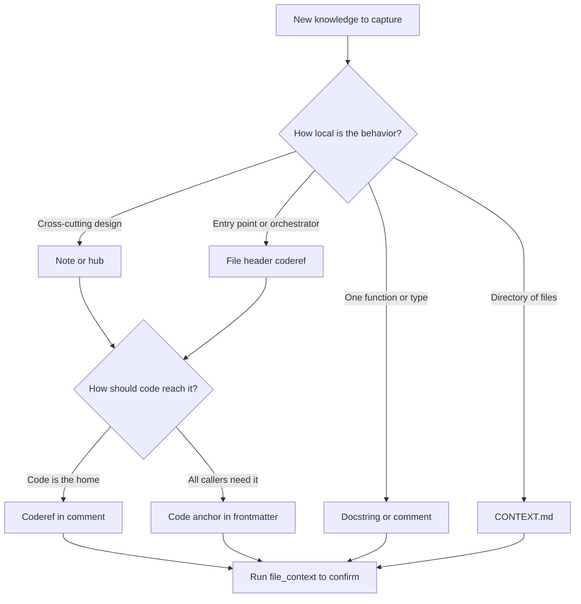

# Rhizome Codebase Documentation Best Practices (Hub)

### What this hub is for

- **Purpose**: Help agents (and developers) document codebases so Rhizome surfaces the right context automatically — the right contract, at the right layer, bound to the right code.
- **Scope**: documentation philosophy, the layering model (docstring → `CONTEXT.md` → note/hub), binding choices (coderefs vs. code anchors), and the agent CLI tools that read it all back.
- **Non-goal**: Replace reading code. The goal is to make "what to read next, and why it matters" obvious and trustworthy.

### Overview: where docs go, and how they get retrieved

Two independent decisions drive every documentation choice. **Layer** = how local is the behavior? **Binding** = how should the doc reach the code that needs it? Get both right and the doc surfaces automatically in `file_context` for exactly the agents who should see it.

The system already knows what is central: PageRank flags high-fanin code, HITS flags authoritative notes. Spend documentation effort where it has leverage — boundary surfaces, high-fanin symbols, and non-obvious behavior. Don't document the obvious; document what would hurt to get wrong.

### Reading order

1. [[Rhizome documentation philosophy]] — the "why": reify human intent so agents operate within constraints across sessions
2. [[Rhizome documentation - Layering + authoring workflow]] — where each kind of doc lives and the author loop
3. [[documentation-binding-rationale]] — why both bindings exist and which to reach for
4. [[Rhizome documentation - Tool guide (agent CLI tools + tradeoffs)]] — how to read it all back with `rzm agent`

### Key concepts

- **Reify intent**: capture decisions, invariants, constraints, and goals — the things agents cannot infer from code alone. Documentation is *caching for human insight*. See [[Rhizome documentation philosophy]].
- **Two-tier note model**: tier-1 anchor/coderef notes are auto-retrieved context-window real estate (target under ~2k chars: invariants, hazards, extension rules only). Tier-2 reference docs/hubs are pulled on demand via [[Search (Hub)]] and linked, not embedded.
- **Right layer, right scope**: docs belong at the layer closest to the behavior they describe (docstring → file header → `CONTEXT.md` → note/hub).
- **Bidirectional binding**: **coderefs** (wikilinks/mentions in comments) say "this code follows this note"; **code anchors** (note frontmatter rules targeting symbols) say "this note applies to all callers of this symbol." See [[Coderefs (Hub)]] and [[Code anchors (Hub)]].
- **Docs are contracts**: read before changing, update when behavior changes, ask before contradicting documented invariants.
- **Tests as executable documentation**: name tests for the invariant they verify; treat failures as doc drift.

### Authoring workflow

1. **Put the local contract in code** — docstring or file header where the behavior lives.
2. **Choose the binding** — coderef when the code is the natural home (entry points, non-obvious behavior); code anchor when *every dependent* of a symbol should see the doc, even callers with no links of their own.
3. **Keep tier-1 lean** — anchored/coderef'd notes carry only invariants, hazards, and extension rules; link out to reference depth.
4. **Verify retrieval** — re-run `file_context` on representative files; confirm the right docs appear and the wrong ones don't. Tune anchors to be surgical (symbols/globs over whole dirs).
5. **Maintain the loop** — when behavior changes, update the nearest docstring/`CONTEXT.md`/note so the next agent retrieves current intent.

The author loop and the binding decision are the same picture as the overview diagram: layer first, then binding, then verify. Full model in [[Rhizome documentation - Layering + authoring workflow]].

### Tool guide pointer

Read documentation back with the complementary `rzm agent` surfaces — orient, discover, read, contextualize:

- `rzm agent vault-context` — orient on an unfamiliar vault/subsystem.
- `rzm agent semantic-query` — discover design/rationale, runbooks, and prior art (use `--mode`, not freeform intent).
- `rzm agent files` — deterministic exact-note lookup by path/tag/property/backlinks.
- `rzm agent file-context` — contract-heavy connective tissue (linked notes + anchored docs) for files you will change; pair with `files` for full source reading.

`file_context` is optimized for constraints and linked docs, not full code bodies. Tradeoffs and the recommended multi-step pattern in [[Rhizome documentation - Tool guide (agent CLI tools + tradeoffs)]]. For how `semantic-query` reaches the ranking pipeline, see [[Search (Hub)]].

### Invariants / rules of thumb

- **Unbound docs don't get retrieved.** A note with no coderef and no code anchor only surfaces if an agent searches for it. Bind it.
- **Coderef when code is the home; code anchor when callers need it.** Don't anchor a whole directory when a symbol/glob will do — keep anchors surgical.
- **Every token in a tier-1 note must change agent behavior.** If a section wouldn't change what an agent does, it probably doesn't belong in an auto-retrieved surface.
- **Keep anchored docs small; link, don't embed.** Large background docs crowd out subsystem-specific contracts in the budget.
- **Layer follows scope.** Local behavior → docstring; directory shape → `CONTEXT.md`; cross-cutting design → note/hub. Don't promote local detail into a hub or bury cross-cutting intent in a comment.
- **Hubs stay thin.** Use them for navigation, not as the primary home of subsystem doctrine — that lives in reference docs and `CONTEXT.md`.
- **Verify, don't assume.** Re-run `file_context` after binding changes; retrieval is the only proof a doc surfaces.

### Related hubs

- [[Vision + Operating Model (Hub)]]
- [[Coderefs (Hub)]]
- [[Code anchors (Hub)]]
- [[Search (Hub)]]
- [[Indexing pipeline (Hub)]]
- [[Agent Skills (Hub)]]
