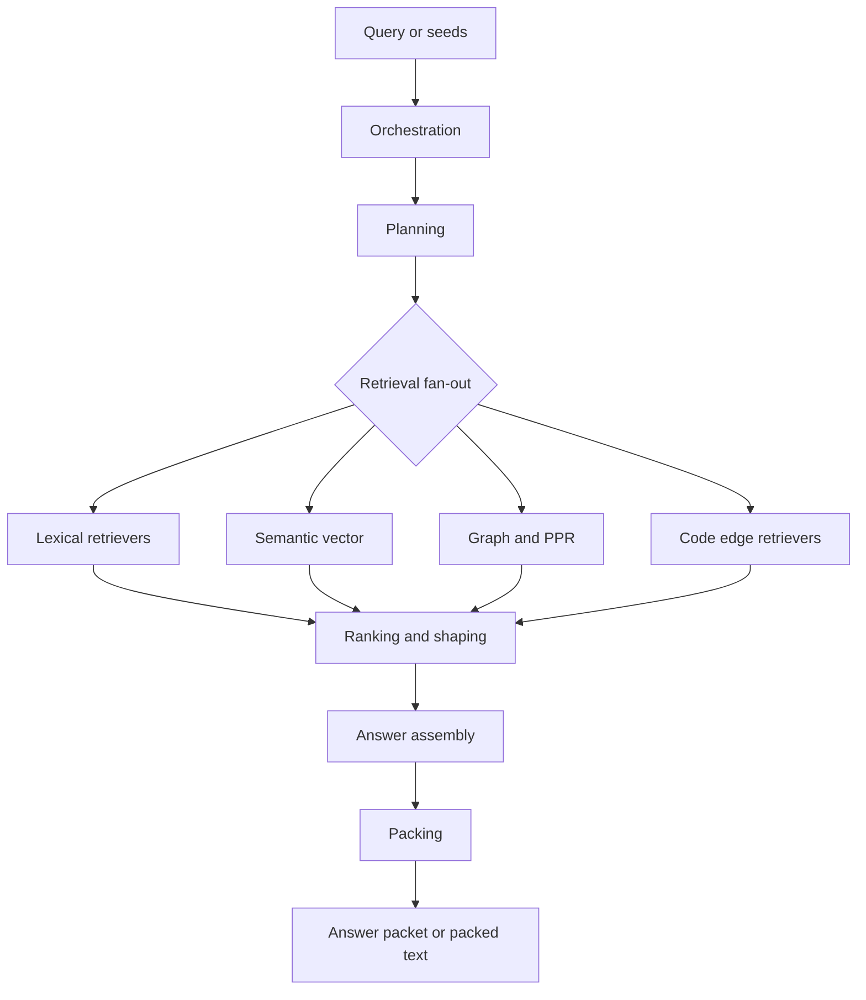

# Search (Hub)

### What this hub is for

- **Purpose**: Understand how Rhizome's unified search works: from focused query or seed to ranked candidates, answer packet, and optional packed context.

### Read this first

- [[Vision + Operating Model (Hub)]]
- [[Code Intel (Hub)]] — code-aware retrieval context
- [[Embeddings (Hub)]] — semantic embedding details
- [[search-answer-workflow]] — product contract for answer-shaped search
- [[search-quality-evaluation-corpus]] — canonical search-quality corpus and update workflow
- [[unified-search-answer-architecture]] — implementation boundaries
- [[search-diagnostics-explain-architecture]] — raw/explain diagnostic payload contract
- [[answer-packet-diagnostics-contract]] — answer-stage role selection and omission rationale

### Reading order (for onboarding)

1. [[search-answer-workflow]] — user-visible answer/search behavior
2. [[search-quality-evaluation-corpus]] — expected query corpus for quality reviews
3. [[unified-search-answer-architecture]] — package boundaries and invariants
4. [[Search - Seed expansion strategies]] — target resolution, explicit seeds, auto-expansion, and intent profiles
5. [[search-diagnostics-explain-architecture]] — raw/explain observability without behavior changes
6. [[answer-packet-diagnostics-contract]] — answer-stage trace vocabulary and invariants
7. `pkg/app/unifiedsearch/CONTEXT.md` — CLI orchestration and answer conversion
8. `pkg/search/CONTEXT.md` — retrieval/ranking module overview
9. `pkg/search/planner/planner.go` — plan construction, seed expansion, weight tuning
10. `pkg/search/retrieval/` — individual retrievers (start with `auto_expand.go`)
11. `pkg/app/answer/CONTEXT.md` — answer packet assembly
12. [[Contextpack (Hub)]] and [[Contextpack - Budget surfaces]] — packing and budget defaults

### Pipeline stages

1. **Orchestration** (`pkg/app/unifiedsearch/`) — normalize query facets, seeds, intent, providers, stores, and warnings.
2. **Planning** (`pkg/search/planner/`) — builds a `Plan` from `QuerySpec`; it does not execute retrieval.
3. **Retrieval** (`pkg/search/retrieval/`) — multiple retrievers run independently under the caller context.
4. **Ranking/shaping** (`pkg/search/relevance/`, shapers, rollups) — blend evidence, preserve diversity, and shape task-local top windows.
5. **Answer assembly** (`pkg/app/answer/`) — pure selection of must-read/supporting evidence, coverage, confidence, and next queries.
6. **Packing** (`pkg/app/presentation/` + `pkg/app/contextpack/`) — optional ranked-result text rendering into caller budget.

### Pipeline diagram

Stages 1-2 (orchestration, planning) run in `pkg/app/unifiedsearch/run.go` and `pkg/search/planner/`. Stages 3-4 (retrieval, ranking/shaping) run inside `Service.Search()`. Stages 5-6 (answer assembly, optional packing) run back in the orchestration layer via `BuildAnswer` and `pkg/app/presentation/`. Retrievers fan out concurrently; everything downstream of ranking is sequential.

### Key concepts

- [[Search - Intent and weight tuning]]
- [[Search - Seed expansion strategies]]
- [[Search - Execution semantics]]
- [[Search - Answer engine packets]]
- [[search-quality-evaluation-corpus]]
- [[search-diagnostics-explain-architecture]]
- [[answer-packet-diagnostics-contract]]
- [[Contextpack - Budget surfaces]]

Broad text search uses deterministic query framing before ranking. Query terms are normalized into code-friendly variants (for example, “notes embedded” also matches `noteembed`, `note_embed`, and `embed_notes`), then candidates receive `query_specificity` evidence from direct path/title/symbol/FQN/snippet matches. Source-owned primary chunks add bounded factual identity/context while preserving the owning file, anchor, note, or NodeRef as the result.

Answer assembly is coverage-driven, not just rank-list rendering. `pkg/app/answer` selects must-read items by role, reports missing evidence slots, and returns follow-up queries. For explanatory queries, docs plus implementation/pipeline evidence are required; tests are optional unless the query or mode asks for tests.

### Intent catalog (high-signal)

`search`, `docs_for_code`, `related_to_seed`, `overview`, `subsystem_overview`, `code_for_docs`, `consolidation`, `find_usages`, `go_to_def`, `explain_symbol`, `tests_for_code`, `refactor_impact`, `callers`, `callees`, `implementers`, `overrides`, `imports`, `data_flow`, `security_audit`.

When explicit intents rely on edges (call graph/tests/definitions) and those edges are missing, `semantic_query` surfaces warnings so callers can decide to fall back or re-index.

`semantic_query` responses include `lanes`, a compact execution status list for major retrieval families. Use it to distinguish "no code was found" from "the code-vector, intel, refs, graph, ontology, call-edge, or test lane was skipped, empty, timed out, or degraded." Broad searches may keep useful results when one retriever lane times out; treat `timed_out`/`degraded` lanes as recall gaps, not proof that no matching evidence exists.

`overview` is the broad, repo-wide conceptual overview intent. It remains doc-led, but representative code entrypoints and key modules should appear when credible code evidence exists.

`subsystem_overview` is the explicit seed-local onboarding intent:
- requires explicit seeds/paths
- prioritizes nearby module docs, anchored notes, and local code entrypoints
- down-ranks generic repo-global/generated docs unless they are directly connected

In the agent-facing `semantic_query` surface, `subsystem_overview` now attempts query-only local target resolution from path-, module-, and symbol-shaped prompts before downgrading to `overview`.

Targeted fetch modes (`go_to_def`, `find_usages`, `callers`, `callees`, `tests_for_code`, `implementers`, `overrides`, `imports`) still work best with explicit `--path`, but query-only calls now attempt path/module/symbol resolution and return structured ambiguity/unresolved warnings instead of broad false-confidence fallback.

### Deep references

- [[pkg/search/planner/CONTEXT|Planning stage]]
- [[pkg/search/retrieval/CONTEXT|Retrieval strategies]]
- [[pkg/search/relevance/CONTEXT|Ranking stage]]
- [[pkg/search/semantic/CONTEXT|Semantic search internals]]
- [[Search - Semantic embedding sync invariants]]
- [[pkg/search/knowledge/CONTEXT|Handle system]]
- [[pkg/search/graphalg/CONTEXT|Graph algorithms]]
- [[pkg/search/graphdb/CONTEXT|Graph persistence]]
- [[pkg/search/embeddings/CONTEXT|Embeddings module]]

### Entry points (code)

- `pkg/search/service.go` — `Service.Search()` runs the pipeline
- `pkg/search/planner/planner.go` — `Planner.Plan()` builds retrieval plan
- `pkg/search/types.go` — `QuerySpec`, `Intent`, `Retriever`, `Ranker`, `Packer`
- `pkg/app/unifiedsearch/run.go` — command-facing orchestration and answer conversion
- `pkg/app/answer/answer.go` — pure answer packet assembly
- `pkg/app/presentation/packer.go` — optional packed result rendering

### Integration points

- `cmd/code_search.go` — CLI `rzm search` command; default output is answer-shaped, with `--raw` for ranked-result debugging
- `cmd/search.go` — CLI `rzm note find` command (legacy filename; not the unified search pipeline)
- `cmd/agent_context.go` — CLI `rzm agent semantic-query` bridge

### CLI retrieval → search pipeline mapping

| CLI command | Implementation | Uses Search Pipeline? |
|----------|---------------|----------------------|
| `rzm agent semantic-query` | `cmd/agent_context.go` | **Yes** — full `Planner.Plan()` → `Service.Search()` |
| `rzm agent file-context` | `pkg/app/cli/context_text.go` | No — uses contextpack + ancestor docs + anchored notes |
| `rzm agent vault-context` | `pkg/app/cli/context_text.go` | No — uses graph communities + repo docs + code overview |
| `rzm agent files` | `cmd/agent_query.go` | No — deterministic file listing + content |

`rzm search` and `semantic-query` are the primary CLI consumers of the search pipeline. They use `QuerySpec` with explicit mode, seed expansion, and auto-expansion for text-only queries; when mode is omitted they default to `search` (seed-only → `related_to_seed`). Keep the user/agent-facing surface answer-oriented; use raw ranked output only for debugging and evaluation.

Diagnostics follow [[search-diagnostics-explain-architecture]]: raw/explain JSON must be additive observability over the same run, never a different ranking, pack budget, warning path, or answer role-selection path. Use [[search-diagnostics-explain-architecture#^SPEC-0043-US2-AC1]] for planning traces, [[search-diagnostics-explain-architecture#^SPEC-0043-US2-AC2]] for retriever degradation, [[Search - Seed expansion strategies]] for target-resolution acceptance checks, and [[answer-packet-diagnostics-contract]] for answer-stage role, omission, confidence, and next-query rationale.

After ranking, primary-chunk, retrieval-planner, or answer-packet changes, run the affected entries from [[search-quality-evaluation-corpus]] and compare answer-shaped output with raw ranked output before updating expectations. Corpus entries must keep the surface, mode, seed flags, fixture/index prep, limits, role expectations, raw expectations, warning expectations, and allowed variability explicit so `rzm search` and `rzm agent semantic-query` failures are diagnosable rather than subjective packet reviews.

For tool selection guidance, see [[Rhizome documentation - Tool guide (agent CLI tools + tradeoffs)]].

### Throughput tips

- Retrievers run concurrently; keep new retrievers I/O-bounded and avoid serial fan-out inside each retriever.
- Deadline-bound runs apply per-retriever stage budgets so one slow lane does not consume the whole broad search.
- Batch store lookups where possible; avoid per-item SQL calls in tight loops.
- Respect `MaxPerOwner` and budget caps to keep packing fast on large corpora.

### Invariants

- Planner does not execute; it only builds a Plan.
- Retrievers run concurrently, or progressively with per-retriever stage budgets when a deadline is present.
- Evidence from multiple retrievers merges on same handle.
- MaxPerOwner limits diversity.
- Diagnostics do not alter ranking, packing, answer role selection, or warning visibility.
