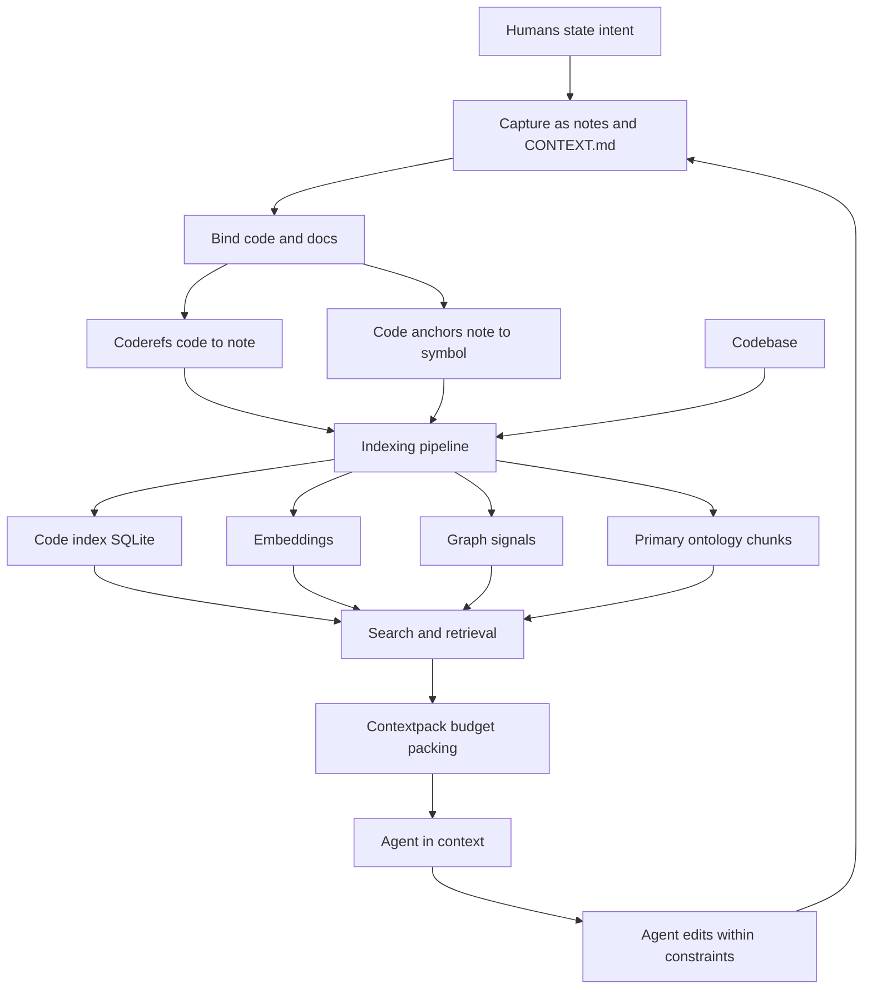

# Vision + Operating Model (Hub)

This is the root hub. Read it first to understand *why* Rhizome exists; every subsystem hub below is a *how*.

### What this hub is for

- **Thesis**: agents are good at implementing what you ask in a session, but **intent evaporates between sessions**. Decisions, invariants, and architecture live in Slack threads and people's heads, so the next agent rediscovers (or violates) them. Rhizome's answer is to **reify human intent into the codebase itself** — caching expensive-to-produce understanding so it can be cheaply retrieved at the moment of work.
- **Knowledge funnel**: move teams from *ambiguity → shared understanding → repeatable AI-forward procedure*. See [[Intent - Knowledge funnel + AI-forward development]].
- **Primary consumer is the agent**: docs stay human-useful, but they are optimized first for what an agent needs to act safely — knowledge, decisions, invariants, goals, architecture. Humans focus on intent, direction, and review.
- **Team-wide, not dev-only**: durable knowledge lives in plain Markdown (links, tags, hubs — the Obsidian metaphor) so anyone can contribute. See [[Team-wide knowledge base (Markdown + Obsidian metaphor)]].

### Big-picture overview

Rhizome is a Go CLI (`rzm`) that builds **one unified knowledge graph over code and docs** and serves it to agents in-context. Both notes and code files are nodes; the distinctive mechanism is **bidirectional binding** ([[documentation-binding-rationale]]):

| Direction | Mechanism | Effect |
|-----------|-----------|--------|
| Code → Note | **Coderefs** (wikilinks/mentions in comments) | "this code follows this contract" |
| Note → Code | **Code anchors** (frontmatter rules on symbols) | "this contract applies to all callers of this symbol" |

Bound docs, plus `CONTEXT.md` module docs, symbol/call-graph indexing, and graph signals (PageRank on code, HITS on notes), are indexed into a single local SQLite database. Agents retrieve from it through `rzm agent` commands and skills — so when they touch a file, the constraints and rationale that apply surface automatically, without searching.

The outer edge is the feedback loop: agents retrieve constraints before changing code, update docs when behavior changes, and the updated docs inform the next session. Without the loop, docs rot; with it, the codebase compounds.

### The operating loop

1. **Capture intent** — record decisions, invariants, goals, and rationale as notes / `CONTEXT.md` during normal work, not as an afterthought.
2. **Bind to code** — attach docs with [[Coderefs (Hub)]] (code→note) or [[Code anchors (Hub)]] (note→symbol) so they get retrieved.
3. **Index** — the [[Indexing pipeline (Hub)]] discovers, parses, and stores notes + code + bindings into the unified [[Code Index (Hub)]].
4. **Enrich** — [[Embeddings (Hub)]] add semantic recall, [[Graph (Hub)]] adds authority/community signals, [[Ontology (Hub)]] adds typed-note structure.
5. **Retrieve in context** — [[Search (Hub)]] / [[Code Intel (Hub)]] rank evidence; [[Contextpack (Hub)]] packs it to the caller's budget.
6. **Operate within constraints** — agents (set up by [[Init (Hub)]], driven by [[Agent Skills (Hub)]]) read the surfaced contracts, act, and update docs — closing the loop.

### Subsystem map

**Binding & capture**
- [[Coderefs (Hub)]] — code→note half of binding (comment/docstring scanning, rewrite on rename).
- [[Code anchors (Hub)]] — note→symbol half (frontmatter rules, matching, watcher behavior).
- [[Rhizome Codebase Documentation Best Practices (Hub)]] — how to document so retrieval stays high-signal (token-dense, two-tier, right layer).

**Indexing & enrichment**
- [[Indexing pipeline (Hub)]] — end-to-end discovery → parse → store → enrich → live updates.
- [[Code Index (Hub)]] — the unified SQLite spine (embeddings + anchors + code-intel tables).
- [[Embeddings (Hub)]] — provider contract, chunk families, vec stores, incremental sync.
- [[Graph (Hub)]] — wikilink graph, communities, hub/authority and recency scores.
- [[Ontology (Hub)]] — GraphQL SDL, typed-note model, NodeRef identity, query recipes, and source-owned primary semantic chunks.
- [[Cache (Hub)]] — cache/watch/refresh behavior that keeps the index live.

**Retrieval & delivery**
- [[Search (Hub)]] — unified search/answer pipeline: plan → retrieve → rank → answer → pack.
- [[Code Intel (Hub)]] — code-aware retrieval, navigation, and Dependency API Cards.
- [[Contextpack (Hub)]] — budget-aware packing and caller budgets.

**Agent operating surface**
- [[Init (Hub)]] — `rzm init`: repo setup, managed agent docs, command-backed helper artifacts, skill templates.
- [[Agent Skills (Hub)]] — packaged workflows across Cursor, Claude, Codex, and MCP.
- [[Agentic Engineering starter (Hub)]] — bundled engineering routing, delivery workflow, and typed note families.

### Read this first

- [[Intent - Knowledge funnel + AI-forward development]] — the thesis in one note.
- [[Team-wide knowledge base (Markdown + Obsidian metaphor)]] — why durable knowledge lives in team-editable Markdown.
- [[Rhizome - What It Is and Why It Exists]] — concise "what + why" overview.
- [[documentation-binding-rationale]] — design rules that keep code↔doc bindings high-signal.
- [[Agent-ready workflows (prompts, commands, skills)]] — how the operating model reaches agents.

### Invariants / principles

- **Reify intent, don't rediscover it** — capture knowledge agents can't infer from code (decisions, invariants, goals), once.
- **Docs are contracts**: read before changing, update when behavior changes, ask before contradicting.
- **Bind or it won't surface** — unbound docs are not retrieved; use coderefs or code anchors deliberately.
- **Token-dense, two-tier** — anchor/coderef notes are context-window real estate (high-signal, target <2k chars); depth lives in reference notes pulled on demand.
- **Document what would hurt to get wrong** — high-fanin code, boundary surfaces, non-obvious behavior; not the obvious.
- **The loop is the value** — retrieval + maintenance must both happen, or the cache rots.
