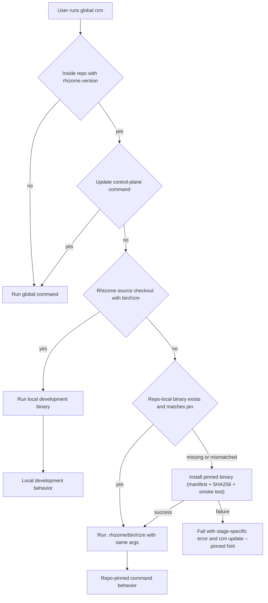
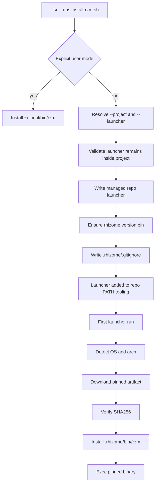
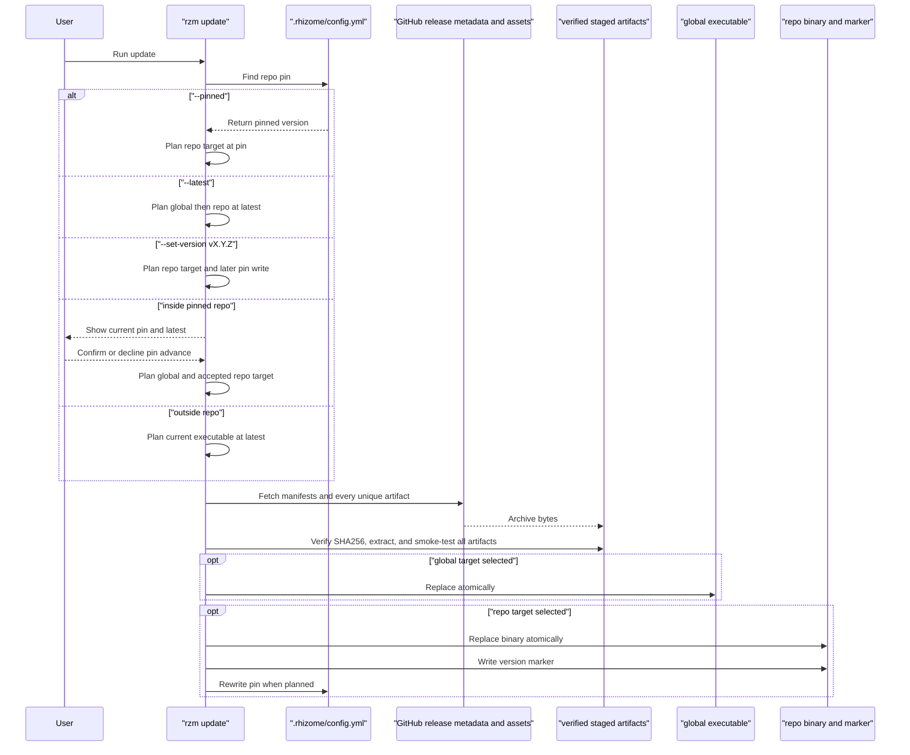
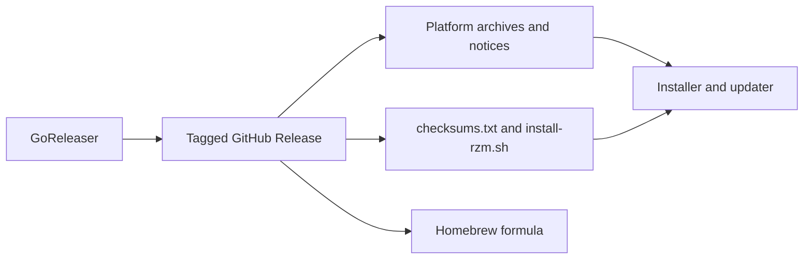
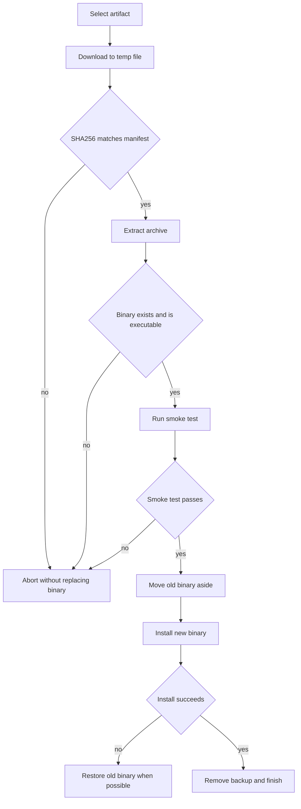

# Version-pinned Rhizome install and update

## Summary

Rhizome installs and updates through a GitHub Releases API and checksum-verified assets. By default, repositories pin the Rhizome version they expect in `.rhizome/config.yml` so every contributor and automation path can use the same binary. A repository may instead declare an external binary manager such as mise; in that mode, the external manager owns the version, installation location, and executable selection while Rhizome owns only its project configuration and workflows. User installs can still follow the latest release stream, but every repository must have exactly one binary-version authority.

Every supported install state must be self-sufficient within its selected scope: a global `rzm` inside a trusted pinned repo self-heals a missing repo-local binary instead of failing, while a repo-launcher install follows the explicit `--user-binary auto|install|skip` policy. Project-local operation through the launcher must work even when user-scope installation is skipped; bare `rzm` is guaranteed only when the selected policy installs or preserves a discoverable user binary. Fresh clones and worktrees (where the gitignored `.rhizome/bin/` is absent) must work on the first launcher command without a manual binary bootstrap step.

This spec governs five connected workflows:

- installing Rhizome for a user or repository
- installing a repo-checked-in POSIX launcher at a caller-chosen path
- updating an existing `rzm` executable safely
- publishing tagged GitHub Release assets and a Homebrew formula
- delegating binary installation and version ownership to an explicitly configured external manager

## Goals

- Make repo-local Rhizome usage reproducible by default through an authored version pin.
- Let mise projects install and version Rhizome through a self-contained `mise.toml` entry without an upstream mise registry entry or a second Rhizome-managed pin.
- Keep binary ownership unambiguous: either Rhizome manages the repository binary and `rhizome.version`, or the configured external manager does.
- Preserve a simple user install path for people who want one `rzm` on `PATH`.
- Provide a repo launcher that can live wherever the repo's mise, direnv, CI, or shell setup expects it.
- Store downloaded repo binaries in `.rhizome/bin/<os>-<arch>/rzm`.
- Let a global `rzm` on `PATH` act as a repo-aware launcher for every user-facing command inside pinned repos, so the repository pin owns command behavior and embedded assets such as `rzm init` templates.
- Make a missing repo-local binary a self-healing condition, not a dead end: trusted clones and worktrees bootstrap on first use.
- Keep project-launcher operation independent of user-scope installation, and leave bare `rzm` working whenever the selected user-binary policy is `auto` or `install`.
- Let global-entry `rzm update` maintain the global executable and repository target according to an explicit update-mode policy, with checksum verification and an atomic replacement path for each target.
- Let repo automation install or refresh the exact pinned version without a prompt.
- Publish both latest aliases and immutable versioned artifacts so repos can pin while users can still track latest.
- Keep the release process observable enough for dry-run review before objects are uploaded.

## Non-Goals

- Adding Rhizome to mise's upstream shorthand registry; externally managed repositories may use mise's explicit `http:rhizome` backend entirely from project configuration.
- Adding manager-specific Rhizome integrations or persisting the external tool's identity in this slice.
- Parsing `mise.toml`, discovering how mise selected the current executable, or invoking mise commands from Rhizome.
- Replacing Homebrew or OS-specific installer integrations.
- Adding cryptographic signatures or notarization in this slice; SHA256 verification is required and signatures can extend the manifest later.
- Defining a new authentication model for private release access.
- Guaranteeing that every shell can self-modify a running Windows executable with the same path used on Unix systems.
- Making backward compatibility with the old installer zip a permanent product contract.

## Requirements

The executable trust and distribution changes in [[open-source-preparation|SPEC-0107]] apply throughout this contract. Automatic delegation, bootstrap, and update commands in a pinned checkout require explicit trust for the canonical checkout. Updates stay on the global executable, but their downloaded binaries execute a version probe. Directly invoked repository scripts already execute repository code.

### Configuration contract

Repositories using Rhizome should author the pin in `.rhizome/config.yml`:

```yaml
rhizome:
  version: v0.38.0
```

Repositories whose `mise.toml` owns the Rhizome version instead declare:

```yaml
rhizome:
  binaryManager: external
```

#### Must

- `rzm init` must write `rhizome.version` to the current CLI version when the field is absent.
- `rzm init` must preserve an existing `rhizome.version` value.
- After writing or preserving `rhizome.version`, `rzm init` must run the pinned update path when `.rhizome/bin/<os>-<arch>/rzm` is missing or reports a version that does not match the pin.
- The preceding pin and pinned-update requirements apply only when `rhizome.binaryManager` is absent.
- `rhizome.binaryManager` must be optional. Absence preserves Rhizome-managed pin/download behavior; the only supported authored value in this slice is the provider-neutral ownership mode `external`, and unknown values must fail configuration validation with an actionable error.
- `rhizome.binaryManager: external` must be mutually exclusive with `rhizome.version`, `rhizome.devBinaryDir`, `rhizome.binaryDir`, and `rhizome.binaryPath`. Mixed ownership must fail configuration validation before download or executable mutation.
- `rzm init --binary-manager external` must write or preserve `rhizome.binaryManager: external`, must not write `rhizome.version`, and must not download, inspect, repair, or delegate to `.rhizome/bin/<os>-<arch>/rzm`.
- A rerun of `rzm init` without `--binary-manager` must preserve an existing valid external-manager selection. Fresh initialization without the flag must preserve the current Rhizome-managed default.
- Changing an existing Rhizome-managed repository to `--binary-manager external` must remove the conflicting Rhizome pin/path fields only after interactive confirmation or `--yes`. It must leave existing gitignored `.rhizome/bin` cache contents untouched.
- Changing an existing externally managed repository back to Rhizome management is outside this slice; users must remove `binaryManager` explicitly before running init.
- Go paths that create, migrate, or fully serialize `.rhizome/config.yml` must use the canonical repo-local config writer's industry-standard two-space YAML indentation. The standalone installer is a minimal text patcher: when the file already exists, it must preserve the file's current child-indent style while inserting or replacing only the immediate `rhizome.version` child, leaving nested mappings and scalar content unchanged; when the file is missing, it must create it with two-space indentation.
- Repo-local installs must not write `rhizome.binaryPath` by default.
- `.rhizome/bin/<os>-<arch>/rzm` must be treated as generated install state and must not be committed by default.
- The repo launcher path is chosen by the installer caller and is not stored in `.rhizome/config.yml`.
- The repo launcher must carry a Rhizome-managed marker so future installs can distinguish it from an unrelated repo file.
- Repo launcher install must refuse to overwrite an existing non-Rhizome file unless the user explicitly confirms or passes `--yes`.
- A repository install/update target exists only when `rhizome.version` is non-empty. `rhizome.binaryPath` and `rhizome.binaryDir` select where that pinned target lives; neither field creates a repo target without a pin.
- A global `rzm` invoked from inside a repo with `rhizome.version` must delegate every user-facing command to the repo-local platform binary when that binary exists, including `init`, `--version`, top-level help, completion, indexing, and commands added later. The update command family, including `update --help`, and trust management run on the installed executable. Update may replace that executable; trust management must never execute untrusted repository code.
- A global `rzm` invoked from inside a repo with `rhizome.version` must self-heal a missing or version-mismatched repo-local platform binary: install the exact pinned version using the same manifest, SHA256, and smoke-test safety as `rzm update --pinned`, emit a one-line notice to stderr, then delegate the original command.
- Mismatch detection must be cheap enough for every delegated invocation: installs record the installed version in a marker file beside the binary (`.rhizome/bin/<os>-<arch>/.version`), delegation compares the marker to the pin without spawning the binary, and a missing marker triggers a one-time `--version` probe that rewrites the marker.
- After checkout trust is recorded, self-healing bootstrap must not prompt, so it works in CI and non-interactive agent shells; when the download or verification fails, the command must fail with an actionable error naming the failed stage and the `rzm update --pinned` fallback.
- The global executable must not retain a command-name or flag allowlist for bootstrap, diagnostics, help, or initialization. Only the update command family, trust management, the explicit `RZM_SKIP_REPO_DELEGATE` debugging escape hatch, the delegated-child recursion guard, already-selected executable detection, and source-development execution rules may bypass repo-pinned dispatch.
- Inside a Rhizome source checkout, global and repo-launcher dispatch must prefer `bin/<goos>/rzm` when that local development binary exists and is executable.
- With `rhizome.binaryManager: external`, the executable that received the invocation must run the command directly. Rhizome must not probe, bootstrap, update, delegate to a repository-local binary, or require the external tool's identity.

#### Should

- Humans and CI should put the repo launcher directory on `PATH` through mise, direnv, shell setup, or CI setup.
- CI should prefer the repo launcher; `rzm update --pinned` remains available when a workflow wants an explicit refresh step.
- Documentation should explain that changing `rhizome.version` is a repo-level toolchain decision, not a per-user preference.
- Documentation should explain that changing a mise-managed Rhizome version means editing `mise.toml`, refreshing the committed `mise.lock`, and installing through the project's locked mise workflow.

### Repo-aware command dispatch

The global binary doubles as a launcher when a user is inside a pinned repo. This avoids a common failure mode where `rzm` on `PATH` is newer or older than the repo pin and silently runs any command with the wrong toolchain. In particular, `rzm init` must use the pinned binary's embedded templates; users must not have to update their global installation to receive the templates selected by the repository pin.



#### Must

- Every user-facing command must delegate from the global executable to `.rhizome/bin/<os>-<arch>/rzm` when the repo-local binary exists, except the explicitly specified update control plane.
- Delegation must preserve command arguments, standard input, standard output, standard error, and exit code.
- Delegation must avoid infinite recursion when the current executable is already the repo-local binary.
- Delegation must be disabled for the child process through an environment guard.
- Missing repo-local binaries must not fall through to running the global binary; the global binary either bootstraps the pin and delegates the original invocation or fails clearly.
- Self-healing bootstrap must hold the repo's install lock (or equivalent) so concurrent invocations do not race the download.
- Rhizome source checkout detection must be based on the Go module line `module github.com/atomicobject/rhizome`; it must not apply to arbitrary repos named `rhizome`.

#### Should

- Dispatch tests should be table-driven around the default-delegate invariant so new commands inherit pin authority without another classification change.
- `rzm init` should prove that embedded templates come from the pinned binary even when the global executable is older or newer.
- Error text for a failed bootstrap should tell the user to run `rzm update --pinned` or rerun the repo installer.
- `rzm init` reruns should surface when the repo pin is older than the running CLI and offer to advance the pin, since a stale pin can no longer parse config, ontology, or query-recipe features authored by newer versions.
- The source-checkout override should use `bin/<goos>/rzm` because that is the default `make build` output.

### Repo launcher workflow

The hosted installer is `install-rzm.sh`. The primary documented path downloads the latest installer source from the GitHub `main` branch, then runs it explicitly for the target project. The installer still resolves released binaries through the manifest-backed release channel; using the latest installer does not override an existing repository pin.

```bash
install-rzm.sh --user --yes
install-rzm.sh --project . --launcher bin/rzm --user-binary skip --yes --json
```



#### Must

- User mode must install to `~/.local/bin/rzm` by default.
- On macOS, user mode must register `~/.local/bin` in `/etc/paths.d/rhizome` so desktop apps and shells can discover `rzm`.
- Positional launcher paths and the legacy `--no-user` flag are not part of the supported caller contract; callers must use the explicit project/launcher/user-binary flags. The installer may accept only the structurally verified historical `--yes <absolute-managed-launcher>` self-refresh handshake as a one-generation migration bridge, translate it to explicit project scope, and reject marker-only, symlinked, outside-project, or extra-argument variants before mutation.
- `--project <root>` must select the repository to mutate without relying on the caller's current working directory.
- `--launcher <relative-path>` must select a launcher inside the project and default to `bin/rzm`; absolute paths or paths escaping the project must be rejected.
- `--user-binary auto|install|skip` must make user-scope mutation explicit; agent guidance must use `skip` unless the user separately authorizes a user install.
- `--yes` must make an already explicit scope non-interactive; it must not infer a project, launcher outside the project, or user-scope install policy.
- `--json` must require `--yes` so machine-readable installs cannot prompt, then emit exactly one stdout object reporting the resolved project root, launcher path, selected pin and its source/relation to the advertised latest release, whether user scope was touched, structural agent-surface status (`present`, `incomplete`, or `init-required`) and reason, confirmation-gated repair candidates when structure is missing, and exact next project-launcher argv only when the structure is present; progress and errors go to stderr. Structural `present` is not runtime readiness, and release capability remains unverified until post-init structure and a minimal session succeed.
- With no `--version`, repo mode must preserve and normalize an existing pin before release lookup, and select latest only when no pin exists; explicit `--version` must intentionally set the pin and must never be silently ignored.
- Repo mode must detect `rhizome.binaryManager: external` before mutation and refuse the project install with guidance to use the owning external manager; user-only installer mode remains independent of repository configuration.
- Repo mode must not require the launcher to live under `scripts/`.
- Repo mode must not eagerly download the repo binary during installation; before normal command exec, the launcher may run the existing binary's instant `--version` check and download the repo pin when the binary is missing, fails to start, or reports a mismatched version.
- Repo mode must write a version pin if one does not already exist.
- Repo mode with `--user-binary auto` must leave bare `rzm` working when no `rzm` is on `PATH`; `install` always performs the user-scope install and `skip` never does.
- Every repo-launcher `update` invocation must refresh the managed launcher from the hosted installer before forwarding or refreshing the pinned platform binary, except when `rhizome.devBinaryDir` selects an authoritative development binary that receives the invocation directly.
- The repo launcher must verify artifact SHA256 before replacing or installing a binary.
- The installer must fail before mutation when it cannot resolve a manifest artifact for the current platform.
- Launcher self-update must verify the hosted installer SHA256 from the selected release's `install-rzm.sh.sha256` before replacing the launcher.
- WSL must resolve to Linux artifacts. Git Bash, MSYS, and Cygwin must resolve to Windows artifacts.

#### Should

- Interactive repo mode should make it clear whether it is using an existing pin, a requested version, or latest.
- Non-interactive mode should not prompt and should fail with actionable error text when required arguments are missing.
- Repo mode should avoid surprising the user when the target launcher path already exists and is not managed by Rhizome.
- The installer should not run `rzm init`; after installation, guidance should ask whether the user wants to initialize and use the project launcher for that command.

### External binary-manager workflow

A mise-managed repository declares both the installation recipe and selected version in its project configuration. It does not need an upstream mise registry shorthand. Rhizome records only that ownership is external, not that the owner is mise:

```toml
[tools]
"http:rhizome" = {
  version = "0.50.5",
  url = 'https://github.com/atomicobject/rhizome/releases/download/v{{version}}/rhizome-{{os(macos="darwin")}}-{{arch(x64="amd64")}}.tar.gz',
  checksum_url = 'https://github.com/atomicobject/rhizome/releases/download/v{{version}}/checksums.txt',
}
```

The repository then records only the ownership decision in Rhizome configuration:

```yaml
rhizome:
  binaryManager: external
```

#### Must

- `mise lock` must resolve every supported platform artifact against the versioned `checksums.txt` into a committable `mise.lock`; `mise install --locked` must then download the selected immutable Rhizome archive, verify it against that locked checksum, expose the archive's `rzm` executable, and update the installed version when the committed `version` changes and the lock is refreshed.
- The documented URL template must map mise's `macos` to Rhizome's `darwin` and mise's `x64` to Rhizome's `amd64`; unchanged `linux`, `windows`, and `arm64` values must resolve to the supported GitHub release matrix.
- Rhizome must treat the selected external executable as authoritative without parsing manager configuration or requiring proof of which tool selected it.
- No command in an externally managed repository may create or update `rhizome.version`, `.rhizome/bin`, or its `.version` marker as a side effect.
- Every `rzm update` mode in an externally managed repository must fail before manifest lookup or executable mutation with actionable guidance to update through the external manager.
- The mise configuration example and `binaryManager` migration must work without a global `rzm`, a checked-in Rhizome launcher, or an upstream mise registry entry.

#### Should

- Projects should pin an exact Rhizome version in committed `mise.toml`; looser mise selectors remain a mise policy choice outside Rhizome's configuration contract.
- Documentation should show `mise lock`, `mise install --locked`, `mise exec -- rzm --version`, and `mise exec -- rzm init --binary-manager external` as the reproducible shell-activation-independent setup path, explain that `external` is provider-neutral, and must not imply that plain `mise install` consumes `checksum_url` directly.

### Update workflow

`rzm update` is the ongoing upgrade path after installation. It knows the default GitHub Releases API endpoint and can also accept an override for tests or emergency release channels. When the invocation enters through a global executable inside a pinned repo, update is an explicit multi-target control plane: each mode declares whether the global executable, repo binary, and repo pin may change. Direct repo-launcher or repo-binary invocations remain repo-scoped because they do not have a trustworthy global-origin executable.



#### Must

- Outside a pinned repo, `rzm update` must update the current executable to latest by default.
- The update requirements below apply only when `rhizome.binaryManager` is absent; externally managed repositories follow the external binary-manager workflow and must not enter Rhizome's update planner.
- Inside a pinned repo, default `rzm update` entered through a global executable must update that global executable to latest, show the current repo pin and latest version, and preserve the existing confirmation boundary before advancing the repo pin and binary. Declining the advance must leave both repo pin and repo binary untouched; a later non-update invocation self-heals a missing or mismatched repo binary to the unchanged pin.
- `rzm update --pinned` must install only the exact `.rhizome/config.yml` version into the repo target without prompting, rewriting the pin, or changing the global executable.
- `rzm update --latest` entered through a global executable must update the global executable and repo binary to latest and rewrite the repo pin to latest. A direct repo-scoped invocation updates only the repo binary and pin.
- `rzm update --set-version vX.Y.Z` must install that exact version into the repo binary and rewrite the repo pin without changing the global executable, regardless of whether the invocation entered through a global or repo-scoped executable.
- `rzm update --set-version vX.Y.Z` requires a pinned repository. Outside one, it must fail before downloading or mutating an executable.
- The updater must download to a temporary location, verify SHA256, extract the binary, run `--version`, and only then replace the target executable.
- The updater must represent destinations explicitly rather than inferring one target from repo presence. It must deduplicate normalized logical destination paths, reuse an immutable verified staged artifact when destinations select the same version, and replace each destination atomically through a destination-local temporary file.
- Executable identity and install destination are separate concepts. File identity may determine whether the running executable is already the repo-selected binary, but must not collapse distinct hardlink or symlink directory entries into one mutation target. Replacement applies to the selected logical directory entry without silently following a repo-target symlink to mutate its referent.
- Repo metadata must commit in binary, version-marker, then config-pin order. A marker failure must leave the pin unchanged; a later pin-save failure must report the successful binary and marker changes as a partial result.
- If one destination succeeds and another fails, output and exit behavior must report the partial result truthfully rather than claiming transactional rollback.
- When no repo pin applies, plain update and `--latest` must choose the currently running executable as the target. `--pinned` and `--set-version` must fail without mutation.
- Managed repo launchers must recognize update modes independent of option ordering, refresh the managed launcher according to their repo-scoped contract, and never infer or mutate a global executable.

#### Should

- The prompt in a pinned repo should include the current pin, the latest version, and the target executable path.
- Failed update attempts should leave the prior executable in place.
- Automation should use `--pinned`, `--latest`, or `--set-version` instead of relying on prompts.

### Release artifact contract

GitHub Releases owns release metadata and tagged assets. Latest discovery uses the stable latest-release endpoint; exact pins use tag lookup. Historical S3 objects remain frozen and are not updated.



#### Must

- Publish `rhizome-<os>-<arch>.tar.gz` and `checksums.txt` as assets of the tagged release.
- Compute SHA256 values from the final archive bytes; retain `<sha256>  <artifact filename>` checksum rows for ordinary tooling and mise.
- Latest discovery must reject draft and prerelease results; an explicit tag may select a prerelease.
- The selected tag must match an exact requested pin. Missing assets, duplicate asset names, or absent checksums must fail before installation.
- Publish `install-rzm.sh` with `install-rzm.sh.sha256` for launcher updates. Include license notices in platform archives.
- Publish the Homebrew formula from the same release. Do not upload S3 aliases, manifests, or compatibility artifacts.
- Preserve reviewed planning, build-only dry runs, atomic local installation, and recoverable GitHub publication.

#### Should

- Explain the one-time manual upgrade needed by older S3-based installations.
- Keep version numbering continuous across the fresh-repository migration.

### Safety and failure behavior



#### Must

- Checksum mismatch must stop installation or update before any target binary is changed.
- Extraction errors must stop installation or update before any target binary is changed.
- A smoke-test failure must stop installation or update before any target binary is changed.
- Failed replacement must preserve or restore the prior executable whenever the filesystem allows it.
- Repo pin rewrites must occur only when the selected update mode calls for a pin change.

#### Should

- Error messages should identify whether failure came from manifest resolution, download, checksum verification, extraction, smoke test, or replacement.
- Temporary files should be cleaned up after successful and failed runs.

## User Stories

### US1 - Repository pins its Rhizome toolchain
- id:: ^SPEC-0033-US1
- summary:: Keep every contributor and automation path on the same Rhizome version by default.
- status:: ready

#### Acceptance Criteria

- `rzm init` writes `rhizome.version` when the field is missing.
- `rzm init` preserves an existing `rhizome.version`.
- Repo-local install writes a launcher at the requested path and `rhizome.version`.
- Repo-local install refuses to overwrite an unmanaged launcher path unless the user confirms or passes `--yes`.
- The repo-local binary is ignored by default while the wrapper and config remain commit-ready.
- A global `rzm` delegates every non-update repo invocation to `.rhizome/bin/<os>-<arch>/rzm` when the repo-local binary exists.
- A global `rzm` installs the pinned binary and then delegates when `.rhizome/bin/<os>-<arch>/rzm` is missing, with a one-line stderr notice and no further prompt after explicit checkout trust.
- `rzm init` installs or repairs the repo-local pinned binary when it is missing or reports the wrong version.
  verification:: On Unix, a repo-local binary must have an execute bit before `rzm init` trusts `--version`; on Windows, `rzm init` must ignore POSIX execute bits and use the `--version` smoke test as the repair signal.

### US2 - User installs Rhizome from the hosted script
- id:: ^SPEC-0033-US2
- summary:: Install Rhizome as a user binary or repo launcher without downloading a GitHub zip.
- status:: ready

#### Acceptance Criteria

- The installer supports explicit `--project`, `--launcher`, and `--user-binary` flags for repo launcher installation.
- The installer supports no-arg interactive mode and `--user --yes` for user installs.
- The installer downloads from the GitHub Releases API and checksum-verified assets.
- The installer verifies SHA256 before writing the executable.
- The repo launcher refreshes itself before every `update` invocation unless `rhizome.devBinaryDir` selects an authoritative development binary that receives the invocation directly.

### US3 - User updates safely from the current executable
- id:: ^SPEC-0033-US3
- summary:: Run `rzm update` to refresh the installed binary while respecting repo pins.
- status:: ready

#### Acceptance Criteria

- Outside a repo, `rzm update` installs latest into the current executable path.
- Inside a pinned repo, default global-entry `rzm update` updates global to latest and prompts before advancing the repo pin; declining leaves repo binary, marker, and pin state untouched, with the next delegated command responsible for self-healing a missing or mismatched repo binary.
- `rzm update --pinned` installs the pinned repo version without prompting and leaves global unchanged.
- `rzm update --latest` updates global and repo to latest when entered globally, while `rzm update --set-version` changes only the repo pin and repo binary.
- The updater verifies checksum, extracts, smoke-tests, and swaps atomically.

### US4 - Maintainer publishes latest and versioned artifacts
- id:: ^SPEC-0033-US4
- summary:: Publish a release channel that supports both latest users and pinned repositories.
- status:: ready

#### Acceptance Criteria

- The release script publishes tagged platform archives, `checksums.txt`, `install-rzm.sh`, and the Homebrew formula through GitHub.
- GitHub release metadata selects the tag and assets; `checksums.txt` supplies archive SHA256 values and `install-rzm.sh.sha256` supplies the installer checksum.
- The release script supports dry-run output before upload.
- Existing S3 downloads remain frozen; new publication creates no S3 objects.

### US5 - Fresh clone or worktree works on the first command
- id:: ^SPEC-0033-US5
- summary:: A contributor, agent, or CI job in a fresh clone or git worktree of a pinned repo runs any normal `rzm` command and it succeeds by bootstrapping the pinned binary automatically.
- status:: satisfied

#### Acceptance Criteria

- With a global `rzm` on `PATH` and `.rhizome/bin/<platform>/rzm` absent, a normal command (for example `rzm agent start`) in a trusted checkout downloads the pinned version, verifies SHA256, smoke-tests, installs to `.rhizome/bin/<platform>/rzm`, prints a one-line stderr notice, and then runs the original command successfully. ^SPEC-0033-US5-AC1
- Bootstrap never prompts; it works identically in interactive shells, CI, and non-TTY agent harnesses. ^SPEC-0033-US5-AC2
- Concurrent first commands in the same repo do not corrupt the install; one bootstraps and others wait or retry on the lock. ^SPEC-0033-US5-AC3
- When the manifest, download, checksum, extraction, or smoke test fails, the command exits non-zero with the failing stage named and a `rzm update --pinned` hint, leaving no partial binary at the target path. ^SPEC-0033-US5-AC4
- A repo-local binary whose recorded version does not match the pin (for example after someone edits `rhizome.version`) is reinstalled to the pinned version before delegation via the same safety path, detected through the install-time version marker without spawning the binary. ^SPEC-0033-US5-AC5

### US6 - Automatic project install can leave bare rzm working
- id:: ^SPEC-0033-US6
- summary:: A maintainer who explicitly selects automatic user-binary setup for a project install gets a working bare `rzm`, while project-only automation can explicitly keep user scope untouched.
- status:: satisfied

#### Acceptance Criteria

- `install-rzm.sh --project <root> --user-binary auto` with no `rzm` on `PATH` also installs the user binary to `~/.local/bin/rzm` (with macOS paths.d registration). ^SPEC-0033-US6-AC1
- After an `auto` or `install` project setup installs the user binary, `rzm <normal command>` works from the repo root in a fresh shell without invoking the launcher path explicitly. ^SPEC-0033-US6-AC2
- `--user-binary skip` produces launcher-only installation with a printed project-launcher path and leaves user/system Rhizome state untouched. ^SPEC-0033-US6-AC3

### US7 - Install Rhizome into an explicit project without unintended user-scope changes
- id:: ^SPEC-0033-US7
- summary:: A user or agent can download the current installer from GitHub main and install a pinned project launcher non-interactively with explicit project, launcher, pin, and user-binary policy.
- status:: satisfied

#### Acceptance Criteria

- `install-rzm.sh --project <root> --launcher <relative-path> --user-binary <auto|install|skip> --yes` installs only within the declared scopes and rejects launcher paths outside the project. ^SPEC-0033-US7-AC1
- Omitting `--version` preserves and normalizes an existing project pin before release lookup, and selects latest only when the pin is absent; `--version` intentionally sets the requested pin. ^SPEC-0033-US7-AC2
- `--json` requires `--yes`, then returns exactly one stdout object with the resolved project, launcher, selected pin and latest-release relationship, user-scope mutation, `present|incomplete|init-required` structural state and reason, confirmation-gated repair candidates, and an exact minimal-session `next` argv only when structure is present; progress and errors remain on stderr, and runtime readiness is not claimed before that session succeeds. ^SPEC-0033-US7-AC3
- The installer does not auto-run init or change a preserved pin. When structure is absent or incomplete, it leaves `next` empty and exposes a confirmation-gated init candidate for the resolved launcher so explicitly disabled managed guidance and shared-skill surfaces can be restored: plain `init` for pins after v0.50.5, and `init --agentsmd on --agent-skills on --yes` for older pins, which still accept those flags. Because neither an older pin nor the advertised latest release proves consolidated-skill support, any pin change is an explicit installer candidate that runs only after the user selects a known-capable release. ^SPEC-0033-US7-AC4
- Tests cover project paths different from the current directory, existing-pin preservation, explicit pin changes, all user-binary policies, unmanaged-launcher refusal, JSON purity and structural semantics, capability-unverified older pins, no-init/no-silent-pin-change behavior, cache and launcher symlink containment, YAML-shape refusal, downloaded-version verification, the complete canonical 16-reference skill structure, current launcher self-refresh, and the exact-fingerprint legacy self-refresh migration bridge with unsafe variants rejected. ^SPEC-0033-US7-AC5

### US8 - Verify project integration without overstating readiness

- id:: ^SPEC-0033-US8
- summary:: A user or agent can follow the primary install path and verify the project pin, managed guidance, shared skill, and minimal runtime without confusing structure with readiness.
- status:: satisfied

#### Acceptance Criteria

- Primary setup guidance explicitly enables managed guidance and shared skills while preserving the installer's no-init and user-scope consent boundaries. ^SPEC-0033-US8-AC1
- Verification checks the project launcher and pin, resolved configuration, managed Rhizome block, canonical shared-skill locations, and a minimal session with an integration-verification intent before claiming readiness. ^SPEC-0033-US8-AC2
- Installer structural checks accept the canonical skill only from supported init-owned surfaces and recognize routed references independent of incidental Markdown punctuation. ^SPEC-0033-US8-AC3
- Tests cover unsupported skill locations, route formatting changes, missing routes, and the documented integration-verification workflow. ^SPEC-0033-US8-AC4

### US9 - Repository pin governs the complete CLI surface

- id:: ^SPEC-0033-US9
- summary:: A user invoking a global `rzm` inside a pinned repository gets the pinned binary's behavior and embedded assets for every command, while update modes change only their explicitly owned global and repo targets.
- status:: satisfied

#### Acceptance Criteria

- A global invocation inside a pinned repo delegates `init`, `--version`, help, completion, index, bare invocation, and representative ordinary commands to the repo-selected binary with arguments, streams, and exit status preserved; new commands inherit delegation without being added to a command allowlist. ^SPEC-0033-US9-AC1
- `rzm init` uses the pinned binary's embedded templates when the global executable has a different version, so updating the global installation is not required to apply the repository-selected templates. ^SPEC-0033-US9-AC2
- Missing or mismatched repo binaries bootstrap through the existing noninteractive, lock-protected install path before delegating the original invocation; only update control-plane handling, trust management, explicit debug/recursion guards, already-selected executable detection, and source-development rules bypass dispatch. Repository-selected development binaries and version probes also require trust. ^SPEC-0033-US9-AC3
- Plain global-entry `rzm update` updates global to latest and preserves the existing repo confirmation behavior; declining leaves repo state untouched and relies on next-command self-healing for a missing or mismatched repo binary. `--latest` updates global and repo to latest; direct repo-scoped update changes only repo state. ^SPEC-0033-US9-AC4
- `rzm update --pinned` changes only the repo binary at the existing pin, and `rzm update --set-version vX.Y.Z` changes only the repo binary and pin; both leave the global executable at its current version, and `--set-version` outside a pinned repo fails without mutation. ^SPEC-0033-US9-AC5
- Multi-target update planning stages and verifies required artifacts before replacement, keeps executable identity separate from logical mutation paths, deduplicates only identical destination paths and artifacts, commits repo binary then marker then pin, and reports per-target partial success or failure truthfully. ^SPEC-0033-US9-AC6

### US10 - An external manager owns the project Rhizome version

- id:: ^SPEC-0033-US10
- summary:: A project can delegate Rhizome installation, selection, and upgrades to an external manager without a second Rhizome-managed version pin or binary.
- status:: satisfied

#### Acceptance Criteria

- A committed `http:rhizome` entry with an exact version and the versioned GitHub release archive/checksum templates lets `mise lock` record checksums for every platform in Rhizome's release matrix and `mise install --locked` install a verified `rzm`; no upstream mise registry entry, global `rzm`, or checked-in launcher is required. ^SPEC-0033-US10-AC1
- `mise exec -- rzm init --binary-manager external` writes `rhizome.binaryManager: external`, does not write `rhizome.version`, and does not create, inspect, repair, or delegate to `.rhizome/bin`; the same ownership mode works for an executable selected by any external tool. ^SPEC-0033-US10-AC2
- Omitting `binaryManager` preserves the existing Rhizome-managed pin/bootstrap behavior, while init reruns preserve an existing valid external-manager selection unless an explicit migration is requested. ^SPEC-0033-US10-AC3
- Unknown binary-manager values and configurations combining `binaryManager: external` with `version`, `devBinaryDir`, `binaryDir`, or `binaryPath` fail before binary download or mutation with actionable ownership guidance. ^SPEC-0033-US10-AC4
- Every normal command in an externally managed repository runs through the executable the external tool selected, without Rhizome probing or delegating to a repository-local binary. ^SPEC-0033-US10-AC5
- Every `rzm update` mode in an externally managed repository fails before network or filesystem mutation and directs the user to update through the external manager. ^SPEC-0033-US10-AC6
- An explicitly confirmed migration from Rhizome-managed pinning to external ownership removes conflicting config fields, preserves existing gitignored `.rhizome/bin` cache contents, and makes subsequent init runs idempotent. ^SPEC-0033-US10-AC7
- Repo-mode `install-rzm.sh` refuses to overlay its launcher/pin workflow onto an externally managed repository before mutation and directs the user back to the owning manager; user-only installer mode remains available. ^SPEC-0033-US10-AC8
- User documentation includes the self-contained `mise.toml` entry and shell-activation-independent install, version verification, initialization, and upgrade commands while explaining that the Rhizome ownership value is provider-neutral. ^SPEC-0033-US10-AC9

## Open Questions

- Should YAML config editing move from installer script text surgery into a small binary helper once the installer/updater protocol stabilizes?
- Should the next release slice add signatures, notarization metadata, or both to the manifest?
