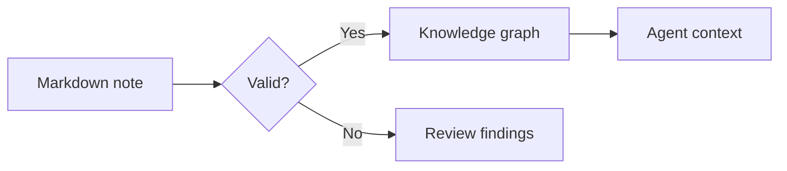
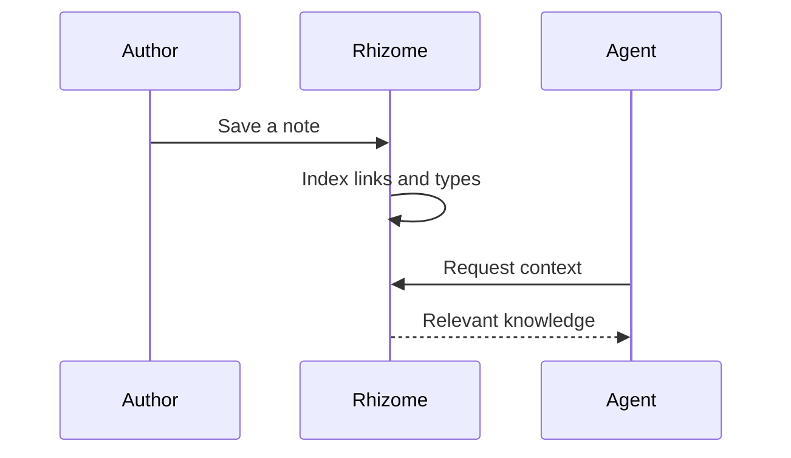
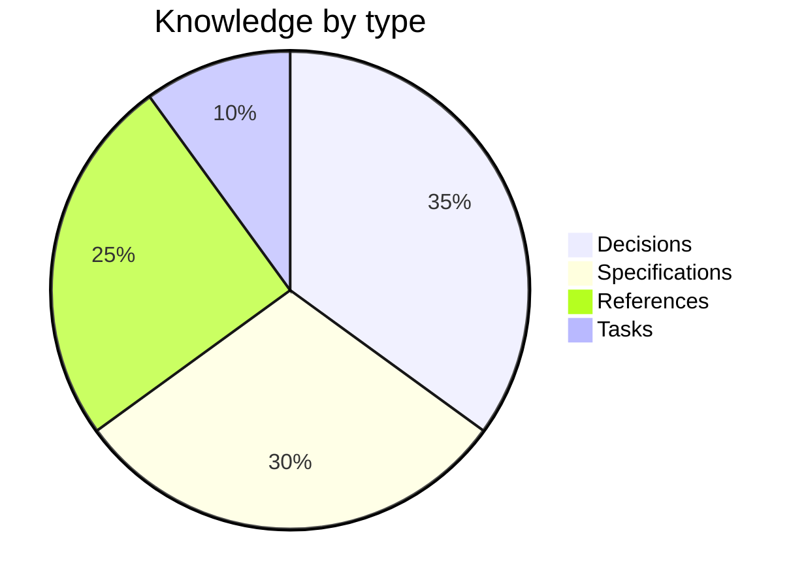

This note renders a Mermaid diagram in read mode.

## Flowchart

```mermaid
flowchart LR
  Source[Markdown note] --> Index{Valid?}
  Index -->|Yes| Graph[Knowledge graph]
  Index -->|No| Review[Review findings]
  Graph --> Agent[Agent context]
```

## Sequence

```mermaid
sequenceDiagram
  participant Author
  participant Rhizome
  participant Agent
  Author->>Rhizome: Save a note
  Rhizome->>Rhizome: Index links and types
  Agent->>Rhizome: Request context
  Rhizome-->>Agent: Relevant knowledge
```

## Chart colors

```mermaid
pie title Knowledge by type
  "Decisions" : 35
  "Specifications" : 30
  "References" : 25
  "Tasks" : 10
```
